1. 电子电器零部件电磁兼容性技术规范   
- 适用范围   
  - 实验项目，技术要求，试验方法   
  - 适用车型，适用系统   
  - 零部件测试有别于整车测试   
- 引用规范
- 术语、定义和缩略词   
- 通用实验条件  
  - 温湿度
  - 样件数量  
  - 供电（低压直流电源，高压直流电源，AC电源）及要求    
  - 试验场地   
    - 相关性：样品间的相关性反应了样品间的相似程度，即不同处理或组织的样品在表达水平方面的相似度。相关系数越 接近1，样品间的相似度越高，样品间的差异基因也越少。   
	- 各测试项目的环境要求    
	  - ALSE（Absorber Lined Shielded Enclosure）
	  - 屏蔽室
	  - 接地平面
	  - 人工网络
	  - 模拟负载和监控
	  - 接地
	  - 其它要求
	  - 容差
- 测试矩阵   
- 电磁发射测量通用技术条件
  - 射频发射测量通用技术条件
    - 实验仪器
	  - 扫描接收机：CISPR 16-1-1:2015
	  - 网络分析仪
	  - 天线 CISPR 16-1-4:2012
	    - 电场测量天线（阻抗，频率，驻波比）
		- 磁场测量天线  
	  - 电流探头满足频率条件
	  - 网络
	    - 人工网络AN
		- 人工电源网络AMN
		- 不对称人工网络AAN
		- 评价
  - 瞬态发射测量通用技术条件
  - 与电网连接相关的发射测量的通用技术条件
    - 工作模式
    - 测试计划
    - 实验报告
  - 电磁抗扰度测试通用技术条件   
    - 射频抗扰度测试通用技术条件
	- 静电放电通用技术条件   
	- 瞬态抗扰度测试通用技术条件  
	- 与电网连接测试的通用技术条件  
	- 功能重要性分类
	- 功能执行状态分级
	- 校准
	- 测试计划
	- 评价
	- 实验报告
- 具体实验项目相关
2. 辐射发射测试     
- 科普   
  - 定义：辐射：辐射是能量以电磁波形式由源发射到空间的现象。虽然我们看不到摸不着，但就像空气一样，我们知道它是切实存在的，比如我们日常生活中经常说的手机辐射、电脑辐射等。辐射发射：辐射发射指电子、电气产品或系统由其内部电路工作时向其周围空间发射的电磁波。这个发射是通过空气作为传播路径而不是导线（包括信号线和电源线），既然称之为发射，那么肯定相对而言在其周围空间就有接收物体或设备存在。   
  - 试验目的：辐射发射（RE）试验主要测试电子、电气设备或系统在正常工作时自身对外界的辐射干扰强度，包括来自电路板、机箱、电缆及连接线等所有部件的辐射骚扰。通过将试验测量值与限值比较来判断EUT的辐射发射是否合格，测量值低于限值则PASS，反之则FAIL。     
  - 实验设备
    - 扫描接收机
	  - 测量仪器应满足CISPR 16-1-1:2015的要求。  
	  - 使用无源天线时，可以在天线和扫描接收机之间加上一个前置放大器，并注意放大器和接收机的特性，避免过载。   
	  - 扫描接收机选用不同的检波器时应设定不同的驻留时间，符合最小驻留时间、最大步长，和带宽的限值要求。    
	  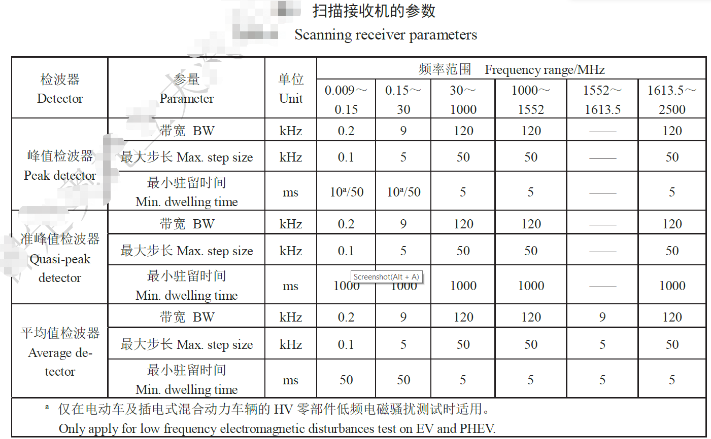   
	  对于某些信号（如低重复率或间歇信号）可能需要更长的驻留时间或多次扫描以确保测得最大值。    
	  测量接收机是EMI测试中最常用的基本测试仪器，仪器类型包括准峰值测量接收机、峰值测量接收机、平均值测量接收机和均方根值测量接收机。测量接收机的几个重要指标分别是：6dB处的带宽、充电时间常数、放电时间常数、临界阻尼指示器的机械时间常数、过载系数。    
	  在准峰值测量时，如果想要在某个频率点得到比较稳定的测量值，则测量时间应大于检波器充放电时间和电表机械时间常数之和，并且测量不止一个周期，所以一般准峰值测量时间要求比较长，在实际测量中，往往先用峰值进行全频段测量，然后再对接近或超过限值的频率点进行准峰值测量，这么做可以大大节省测量时间。    
	- 天线是辐射发射试验的接收装置，由于辐射发射试验频率范围覆盖30MHz—18GHz，所以相应的在不同频率范围段有不同的天线相匹配，例如：    
	  - 0.15MHz~30MHz，1m长的垂直单极天线（如果天线阻抗不是50Ω，应采用合适的天线匹配单元）  
      - 30MHz~300MHz，双锥天线
	  - 200MHz~1000MHz，对数周期天线你
	  - 1000MHz~2500MHz，喇叭或对数周期天线
	  - 所有天线应符合CISPR 16-1-4:2012的要求
	  - 使用SAE ARP958.1 Rev D：2003-2中的1m法确定双锥天线、对数周期天线和喇叭天线的天线系数。
	  - 在整个测量的频段上，应保证匹配单元和测量接收机之间达到阻抗匹配，最大驻波比（SWR）为2:1。从天线到接收机的天线系统的任何衰减都应得到修正。    
	  - 应注意保证输入电压不超过匹配单元的额定脉冲输入以免发生的过载。
	  - 双锥天线通常在30MHz到80MHz频段内的驻波比达10:1，因此当接收机的输入阻抗不是50Ω时，会产生额外的测量误差。在天线输出端使用衰减器（最小3dB）会降低这种额外误差。  
	- 电波暗室   
	电波暗室，是主要用于模拟开阔场，同时用于辐射无线电骚扰(EMI)和辐射敏感度(EMS)测量的密闭屏蔽室。电波暗室的尺寸和射频吸波材料的选用主要由受试设备(EUT)的外行尺寸和测试要求确定，常见的有3m法和10m法。   
	  - 10米法半电波暗室   
	  EMCT-10是按照10m测试距离设计的半电波暗室，主要由主暗室、控制室和功放室组成（可选择传导测试室），用于10m或者3m距离的辐射抗扰度测试和辐射发射的符合性测试。
	  10米法电波暗室是最具普及性的标准测试环境，主要是为了满足大尺寸电子系统的测试需求以及一些电子产品的行业测试标准之要求，同时也可以进行3ｍ法的测试，静区可扩大至5米甚至8米直径或者更大，广泛应用于IT产品，家用电器，医疗器械，汽车整车和零部件，大型军工电子系统，工业电子系统，通信领域等电磁兼容测试。加配转鼓系统等可以完成道路车辆的电磁兼容测试项目。
	    - 参考配置  
		  - 典型屏蔽内尺寸：21m（长）×12m（宽）×9m（高）。
		  - 屏蔽结构：采用Smart Shield Twin Wall双层屏蔽结构，从里到外依次为高性能复合锥形吸波材料、铁氧体、防腐多层板、屏蔽钢板和标准屏蔽模块，在两个相邻的标准屏蔽模块间采用导电屏蔽衬垫Gasket进行良好的RF屏蔽和电接触连接。   
		  - 标准屏蔽模块：尺寸为3m×1m，由2mm厚的双面热镀锌钢板在四边经两次折弯制成。双面热镀锌钢板的厚度≥2mm，镀锌层厚度≥20μm，并且厚度均匀。模块之间采用高强度标号为8以上的螺丝M10进行连接。    
		  - 吸波结构：墙面吸波材料由镍锌铁锰组成的低频段吸波材料铁氧体（100mm×100mm×6.7mm）和高性能复合锥形截尖吸波材料ESSORB-VHY-30-NRL（可根据需要另行选择）组成；地面可移动吸波材料由ESSORB-VHY-12-NRL和铁氧体构成。吸波材料上可以覆盖白色反光板，用于美化内部环境和增加亮度。     
		  - 屏蔽门：2m×2m或者3m×3m或更大等尺寸可选择，也可根据需要进行特殊尺寸设计，同时配置0.9m×2m员工通道门一个，类型为手动、半自动和全自动轨道；
		  - 波导窗：尺寸为600mm×600mm（带法兰），截至频率为18GHz，可根据需要另行选择；
		  - 嵌入式转台：直径为4m，负重为3吨，也可根据需要另行定制其它类型的转台；
          - 高架地板：负重为3吨/㎡设置为重载区，其它区域为１吨/㎡，高度一般为50cm；
          - 滤波器：用于电源的380V，220V，110V，DC等以及网络，通信等信号滤波；
          - 天线升降塔：升降达4m高，带水平和垂直极化，可安装各种类型的天线；
          - 视频系统：2套数字彩色监视系统，其中1套固定在墙面，1套地面可移动；
          - 语音系统：确保主暗室和功放室之间可以畅通对讲；
          - 火灾报警系统：采用高灵敏度空气采样分析系统，符合中国公安部防火产品的相关规定；
          - 照明系统：采用卤素照明灯，距地面1m高的照度值达250Lux，可升降；
          - 升降平台：便于大型被测物进出暗室，根据暗室门的尺寸定制自动升降平台；
          - 尾气排气系统：负责将车辆尾气直接排放至暗室外，确保暗室内空气清晰正常；
          - 冷风系统：为了车辆或者其它高温产品的正常测试，提供冷风强送系统一个；
          - 转鼓系统：为了满足道路车辆的电磁兼容测试标准，可根据车辆类型定制转鼓系统。
		- 主要性能
		  - 辐射抗扰度测试：符合IEC/EN 61000-4-3等标准的要求。
          - 辐射发射测试：符合EN 50022、EN 50147-2、GJB 151A和GJB 152A等标准要求。
          - 静区尺寸：4米直径2米高度的圆柱体内（或者根据需要定制更大尺寸的静区）
		    - 所谓静区就是指微波暗室内受杂散波干扰最小的区域   
          - 屏蔽效能：满足标准EN50147-1或者更优
          - 归一化场地衰减（NSA）：在30MHz-1GHz内按CISPR16-1-4和ANSI C63.4标准满足±3.5dB，±3.0dB，±2.5dB等可供选择
		    - 参考文章《归一化场地衰减的计算与测量》
          - 场强均匀性（FU）：按IEC61000-4-3的要求进行测，在0～6dB内
          - 场地电压驻波比（sVSWR）在1GHz—18GHz范围内按CISPR16-1-4标准不大于6dB
          - 背景噪声(Ambient Background Noise,称ABN)：比CISPR22标准规定的限值低10dB   
	  - 3米法半电波暗室    
	  EMCT-3是按照3m测试距离设计的半电波暗室，主要由3米法主暗室、操作控制室和功放室组成（可配置传导测试室），用于3m距离的辐射抗扰度测试和辐射发射的符合性测试。完整的暗室系统可以覆盖CISPR、EN、FCC、GB、GJB等多种标准，具备升级到全波暗室的能力。可广泛应用于IT产品，家用电器，医疗器械，汽车零部件，小型军工电子产品，工业电子用品，通信领域等电磁兼容测试。加配特殊接口后可以进行特殊产品的测试，如水表，燃气表，电能表等。         
	  - 主要性能   
	    - 辐射抗扰度测试：符合IEC/EN 61000-4-3等标准的要求。
        - 辐射发射测试：符合EN 50022、EN 50147-2、GJB 151A和GJB 152A等标准要求。
        - 静区尺寸：2米直径2米高度的圆柱体内
        - 屏蔽效能：满足标准EN50147-1或者更优
        - 归一化场地衰减（NSA）：在30MHz-1GHz内按CISPR16-1-4和ANSI C63.4标准满足±3.5dB，±3.0dB，±2.5dB等可供选择
        - 场强均匀性（FU）：按IEC61000-4-3的要求进行测，在0～6dB内
        - 场地电压驻波比（sVSWR）在1GHz—18GHz范围内按CISPR16-1-4标准不大于6dB
        - 背景噪声(Ambient Background Noise,称ABN)：比CISPR22标准规定的限值低10dB
	  - 参考配置  
	    - 典型屏蔽内尺寸：9m（长）×6m（宽）×6m（高）。
        - 屏蔽结构：采用Smart Shield Twin Wall双层屏蔽结构，从里到外依次为高性能复合锥形吸波材料、铁氧体吸波材料、防腐多层板，屏蔽钢板和标准屏蔽模块，在两个相邻的标准屏蔽模块间采用导电屏蔽衬垫Gasket进行良好的RF屏蔽和电接触连接。
        - 标准屏蔽模块：尺寸为3m×1m，由2mm厚的双面热镀锌钢板在四边经两次折弯制成。双面热镀锌钢板的厚度≥2mm，镀锌层厚度≥20μm，并且厚度均匀。模块之间采用高强度标号为8以上的螺丝M10进行连接。
        - 吸波材料：墙面吸波材料由镍锌铁锰组成的低频段吸波材料铁氧体（100mm×100mm×6.7mm）和高性能复合锥形截尖吸波材料ESSORB-VHY-18-NRL（可根据需要选择型号）组成；地面可移动吸波材料由ESSORB-VHY-12-NRL和铁氧体构成。吸波材料上可以覆盖白色反光板，用于美化内部环境和增加亮度。
        - 屏蔽门：0.9m×2m.，1.2m×2m、1.5m×2、2m×2m等多种尺寸可选择，也可根据需要进行特殊尺寸设计，类型包括手动，电动，气动，以及全自动轨道门等可供选择。
        - 波导窗：标准尺寸为400mm×400mm（带法兰），截至频率为18GHz，可根据实际需求另行设计（如尺寸为300mm×300mm或450mm×450mm，截止频率到40GHz）。
        - 嵌入式转台：直径为2m，负重为1吨，也可根据需要另行定制。
        - 高架地板：负重为1吨/㎡，高度一般为20cm 至30cm,与转台的负重能力一致。
        - 滤波器：用于电源的380V，220V，110V，DC等以及网络，通信等信号滤波。
        - 天线升降塔：升降达4m高，带水平和垂直极化，可安装各种类型的天线。
        - 视频系统：2套数字彩色监视系统，其中1套固定在墙面，1套地面可移动。
        - 火灾报警系统：采用高灵敏度空气采样分析系统，符合中国公安部防火产品的相关规定。
        - 照明系统：采用卤素照明灯，距地面1m高的照度值达250Lux，可升降 
	电波暗室可以由开阔场地替代：开阔场地至少应该在椭圆范围内没有任何可能反射电磁波的物体。使用开阔场地试验的话，EUT和天线放置于椭圆的两个焦点上，测量接收机则放在椭圆外。测试桌天线架都应是非金属的；地面应铺设金属板或金属栅网，板或网的连接处不应有电不连续点，孔、缝直径小于0.1λ，λ为拟测试的最高频率的波长，对于频率为1GHz，孔、缝直径应小于30mm；开阔场地的环境噪声越小越好，至少应比标准规定的EUT的骚扰限值低6dB。   
	通常实验报告会给出设备类型：     
	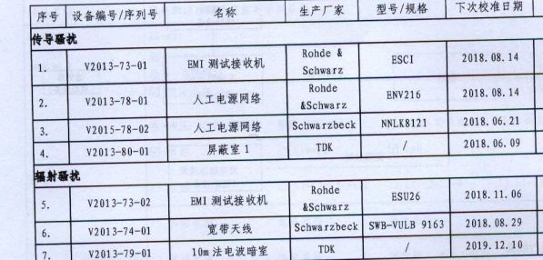    
	- 试验方法及配置    
	EUT发出的电磁波将在各个金属面上发生发射和多次反射，故测试天线接受到的场强是直达波和反射波的矢量和，因此天线或者EUT的位置稍有变化，测试结果就会有很大不同，也因此在RE测试中，天线的高度、天线的极化方向以及转台的角度都要不断改变，以期检测到设备辐射的最大点。     
	以八木天线为例的测试布置，如图          
    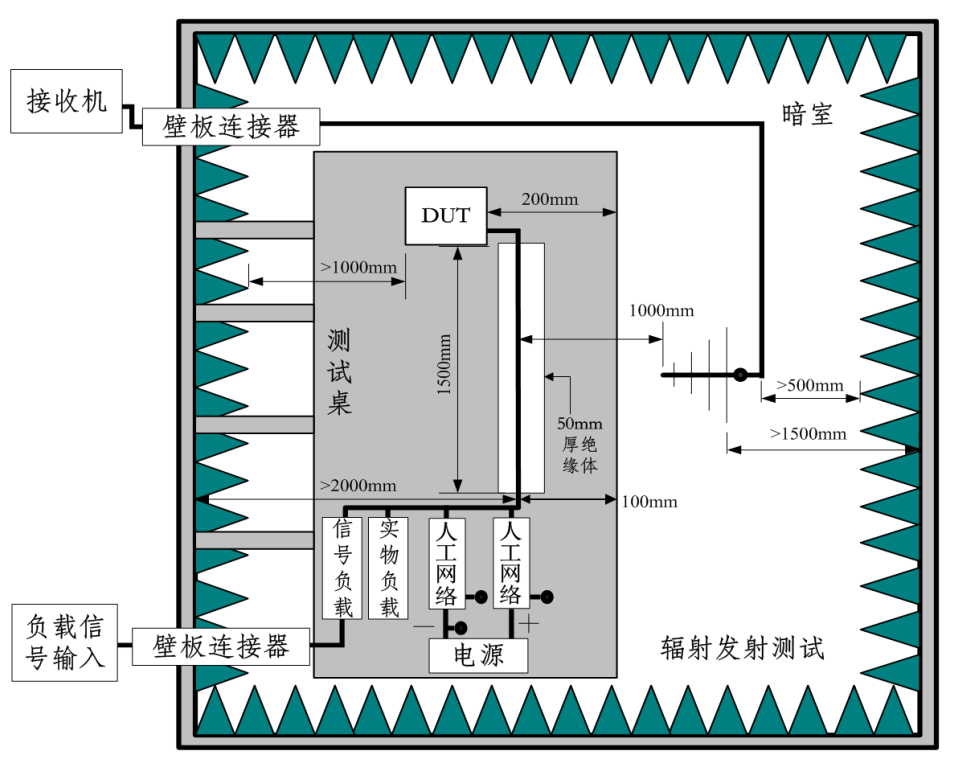     
    - 测试要素（举例）    
      - 场地：开阔场地或半电波暗室    
      - 木桌：0.8m~1.1m   
      - 有时要求转台360°旋转，有时不要求
      - 天线：选择合适类型，且在1~4米移动（可选），并进行垂直极化和水平极化测试（依据频率可选）；
      - 阻抗匹配（一般50Ω）
      - 测试接收机，依据具体要求设定检波方式
      - 天线的阻抗、同轴电缆的阻抗和干扰测量仪的输入阻抗都应相等，阻抗不匹配将引起反射，形成驻波，影响读数准确性。水平和垂直两种状态都要测量，垂直放置时天线的最低端离地应大于25cm，以免影响天线的性能，采用频谱分析仪设在最大保持方式和对数dB显示方式。     
    - 发射辐射限值     
    一般测试规范和测试报告（有可能）中会给出。
    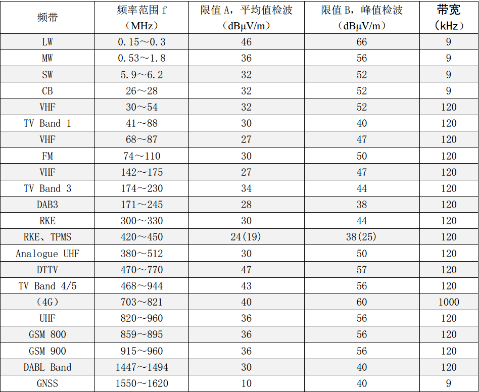         
    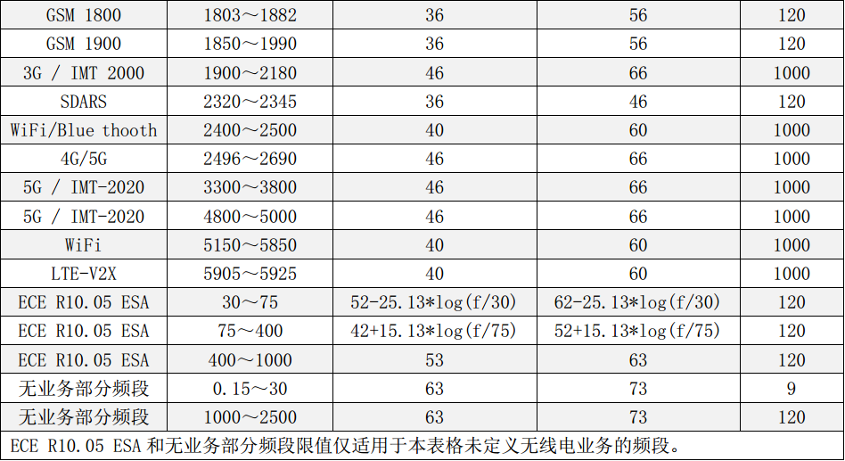     
      - 其中频率范围为待测频率范围，带宽为测试接收机的工作带宽，剩余两项为测试结果。     
      - 关于几个测量值（涉及到了检波器的知识）    
        - 峰值（PK），所表现的就是测量波形的瞬时最大值。对应的峰值检波器就要求电路的充电足够快，而放电足够慢。峰值的大小只取决于信号的幅度。峰值检波，它的充电时间常数很小，即使是很窄的脉冲也能很快充电到稳定值，峰值检波的特点首先在军用设备的骚扰发射试验中被优先采用，因为好多军用装备只要单次脉冲的激励就可以造成爆炸或数字设备的误动作，而无需像音响设备那样讲究时间的积累。         
        - 准峰值（QP），所表现的是测量信号能量的大小。由于准峰值检波器的充电时间要比放电时间快得多，因此信号的重复频率越高，得出的准峰值也就越高。（在GB9254-1998中提到过在测量接收机上所示的读数在限值附近波动时，则读数的观察时间应不少于15s，记录最高读数，而孤立的瞬间高值忽略不记。）准峰值检波器还能以线性方式对不同幅度的信号起响应。这样，准峰值既可以反映信号的幅度，也能反映出信号的时间分布。准峰值测量的特点：    
          - 幅度大、重复频率低的信号与幅度小、重复频率高的信号可能会有相同的准峰值输出。
          - 对于连续波信号，准峰值测量的结果与峰值测量的结果是一样的。
          - 准峰值测量要比峰值测量慢2-3个数量级。		
		  - 准峰值检波，反映的是信号的能量。这种检波器的冲放点时间常数介于平均值于峰值之间，在测量周期内的检波器输出既与脉冲幅度有关，又与脉冲重复频率有关，其输出与干扰对听觉造成的效果相一致。
		- 平均值检波，其最大特点是检波器的充放电时间常数相同，特别适用于对连续波的测量。
	  - 关于几个单位   
	    - 0dBV:20lg(1V/1V)      
		- 0dBmV:20lg(1mV/1mV)     
		- 0dBuV:20lg(1uV/1uV)    
		- 区别是基准单位的不同    
- 总结   
  - 通用配置   
  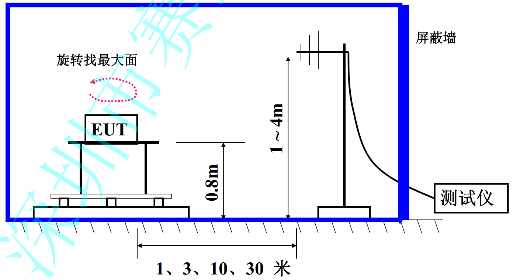   
  - 常用天线   
  - 测量接收机    
    - 采用准峰值测量接收机、平均值检波、峰值检波和均方根值检波的测量接收机分别称为平均值测量接收机、峰值测量接收机和均方根值测量接收机。
	- 民品一般判定的标准以最终的准峰值测量为准,但军品一般以峰值为主   
  - 试验场地  
  电磁兼容的测试项目都要求有特定的测试场地，其中以辐射发射、射接收和辐射抗扰度对测试场地的要求最为严格。相关标准规定辐射发射与接收测试应在开阔试验场(OATS)或电波暗室进行。
  - 电波暗室   
    - 电波暗室（anecholc chamber）是辐射骚扰场强的测量场所
	- 有两种结构形式：半电波暗室和全电波暗室
	- 半电波暗室由电磁屏蔽室加射频吸波材料组合构成，侧面和室顶敷设射频吸波材料，地面为电波反射面，模拟开阔试验场
	- 六个内表面全部敷设射频吸波材料时，称为全电波暗室．模拟自由空间。
	- 应用
	  - 由于好的开阔试验场选址不易，使用不便
	  - 建在市区又会因背景噪声电平大而影响 EMC 测试
	  - 于是模拟开阔试验场的半波暗室成了应用较普遍的EMC测试场地。
	  - 美国FCC、日本VCCI以及IEC、CISPR等标准准许用半电波暗室替代开阔试验场进行EMC测试
	  - 电波暗室用于电磁辐射干扰测量和电磁辐射敏感度测量。
	  - 主要性能指标用归一化场地衰减NSA和测试面场均匀性来衡量
	- 结构
	  - 半电波暗室中的测试环境是要模拟开阔试验场的传播条件，因此暗室尺寸应以开阔试验场的要求为依据。
	  - 测试距离R为3m、10m等，测试空间的长度为2R，宽应为1.73 R。
	  - 3米法测试时，接收天线的高度要求在1~4m范围内改变；
	  - 10米法测试时，天线高度要求在2~6m范围内改变。
	  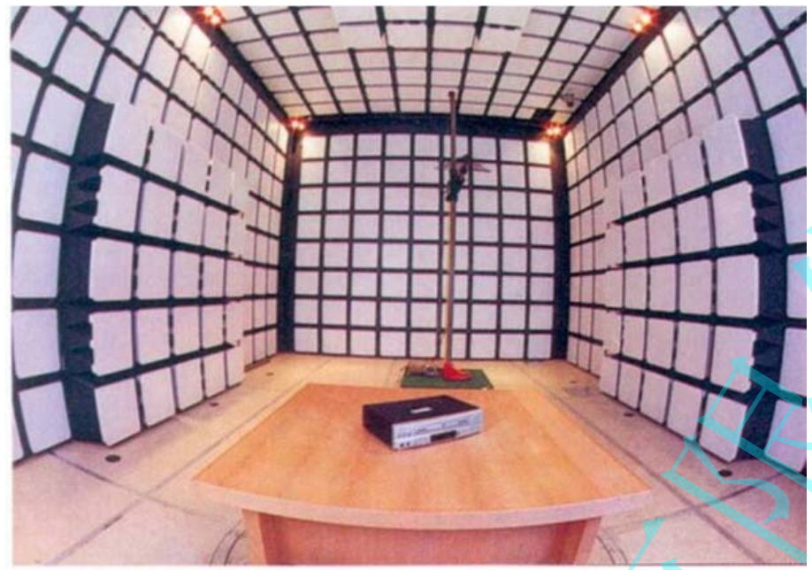   
	  - 上图所示暗室就是五个内表面贴铁氧体片且在主要部分加含碳海绵复合吸波材料。
	  - 1GHz以下主要靠铁氧体片起作用， 1GHz以上主要是含碳海绵复合吸波材料起作用。
  - 受试设备的配置（EUT）   
    - 所需连接的电缆负载（或装置）的数量、型号和长度；
	- 所需安装的模块（如各类插卡，低板）的数量和类型；
	- 由数个独立单元组成的系统中、有代表性的、最小单元的组合和数量；
	- 既能成为系统组成部分，又能自成分统的设备单元，试验时可独立系统进行；
	- 对于功能上有交互作用的，连接实际负载或能代表其电气特性的模拟负载；
	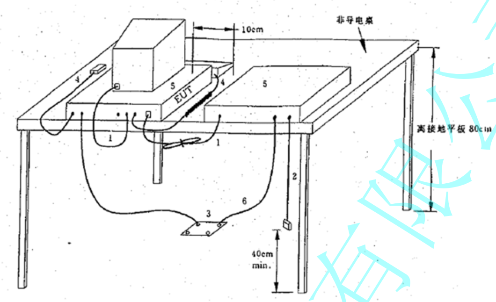     
  - 工作状态的选择
    - 使其能够代表实际中的典型应用情况；使其发射最大
	- 如果没有给定试运行时间，在试验之前， EUT应运行足够的时间，以使保证其运行的状态和方式是典型状态
	- EUT应在额定的电源电压下工作。如果骚扰电平随电源电压显著地变化，则应在0.9～1.1倍额定电压下，重复那些测量。如果EUT的额定电压不止一种，应在产生最大骚扰的额定电压下进行试验。   
	- 在大多数情况下，我们很难一下就找到EUT最大发射时的工作状态，在这种情况下，试验人员需要不断变换EUT的工作状态（或运行程序），反复试验，直至找出最大发射时的状态。
	- 通过积累，逐渐确定某一类产品最大发射时的工作状态。
  - 限值（举例）    
  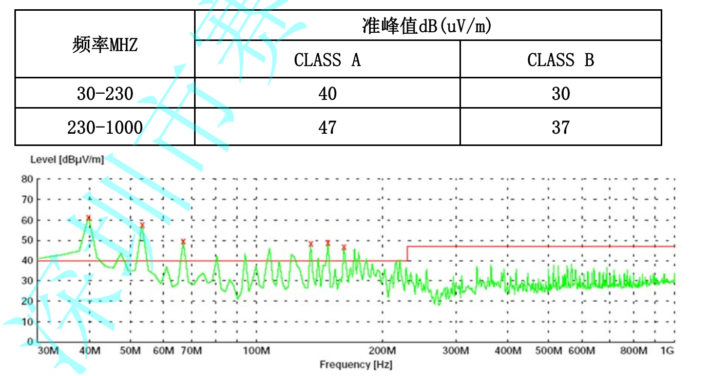    
- 原理分析(参考[电磁骚扰辐射发射测试](http://www.anytesting.com/news/1914882.html))       
  电磁骚扰发射（EMI）包括辐射发射（RE）和传导发射（CE）。辐射发射测试是测量受试设备（EUT）通过空间传播的骚扰辐射场强。传导发射测试是测量受试设备（EUT）通过电源线或信号线向外发射的骚扰电压和电流。   
  在30MHz～18GHz频率段，测量骚扰的电场强度。1GHz以下使用开阔场地或半电波暗室，模拟半自由空间；1GHz以上使用全电波暗室，模拟自由空间。如采用替代法测量，则测试场地可用开阔场地、半电波暗室或全电波暗室，测量结果用发射功率表示。     
  在9KHz～30MHz频率段，测量骚扰的磁场强度。如果EUT较小，则将其放在大磁环天线（LLA）中，测量骚扰磁场的感应电流。如果EUT较大，则采用远天线法，用单小环在规定距离测量骚扰的磁场强度。     
  为了对辐射骚扰有一个统一的度量，标准不但对测量布置、测量方法作了规定，而且对骚扰测量仪、天线和测量场地都作了严格的规定，现分别加以讨论。     
  标准要求测试在开阔场地或半电波暗室内进行，场地必须符合NSA（归一化场地衰减）的要求。测试布置如图1所示。    
  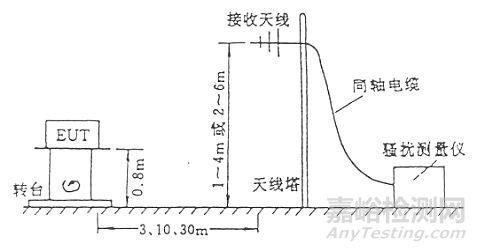     
  测试天线和受试设备（EUT）之间的距离应符合远场条件，标准规定为3、10m或30m。远场的场结构比较简单，电场方向、磁场方向和电波传播方向三者互相垂直，波阻抗即电场强度与磁场强度之比为377Ω，场强随距离一次方衰减。近场的场结构比较复杂，在电波传播方向存在电场或磁场的分量，三者不一定互相垂直，波阻抗不为常数而是随距离变化，场强随距离平方或三次方衰减。     
  比较近场和远场的特性可知，在远场条件下测量场强一致性和重复性较好，测量误差较小。在远场条件下测试距离d应满足下列情况：       
  a)  d ≥ λ/2π, 如EUT被看作是偶极子天线，则误差为3dB。      
  b)  d ≥ λ，  可看作是平面波，如EUT被看作是偶极子天线，则误差为0.5dB。      
  c)  d ≥ 2D2/λ， D为EUT的最大尺寸，该条件仅适用于D>>λ的情况。      
  在30MHz～1000MHz频率段，λ为10m～0.3m, d=3m、10m、30m时都符合上述远场条件。      
  国内暗室绝大部分只能进行3m法测试,而标准上给出的限值很多都是针对10m法测试的,所以应该将它们转换为3m法的限值,转换公式为：L2 ＝L1 (d1/d2)或L2 (dB) ＝ L1 (dB)+ 20lg(d1/d2)        
  式中L1和 L2分别为测试距离为d1 和d2时的辐射限值,例如GB9245中仅规定了信息技术设备在10m 测量距离处的辐射骚扰限值，由此可转换为3m处限值，如表1所示。      
  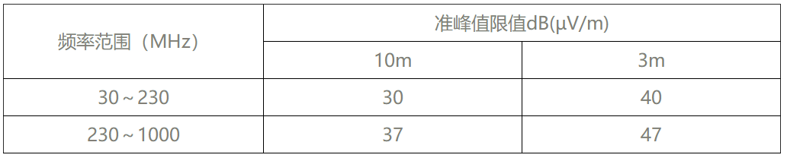     
  一般不同频率段的限值是不一样的，过渡频率点应该采取较低的限值，表1中230MHz的限值应取较低值：30dB(µV/m)（10m法），40dB(µV/m)(3m法)。    
  在确定测试距离时常遇到起始点和终止点的问题，起始点是被测设备（EUT）的边框，这在标准上有明确的规定。终止点应该在天线的什么部位？当天线是对称振子天线或双锥天线时，终止点在天线的中间部位。当天线是喇叭天线时,终止点应为喇叭口。但当天线是对数周期天线和混合宽带天线时，终止点就不好确定，标准中也没有明确规定。对数周期天线，根据其工作原理，在频率较高时是短振子起作用，；频率较低时是长振子起作用。如果把终止点定在对数天线的顶端，则高频测量时距离约为3m，而低频测量时距离偏移较大。由于天线接收的场强E∝f/d，而由距离引起的测量误差为△E∝f△d/d2，显然对于同样的距离偏移，频率越高，产生的场的测量误差就越高，所以笔者认为终止点放在对数周期天线的顶端比较合适。如果天线上已有天线中心的标记，则终止点放在天线中心的标记处。      
  由于达标测试是测量EUT可能辐射的最大值，所以EUT应放在转台上（可360°旋转）以便寻找EUT的最大骚扰辐射方向。台式EUT离地面高度通常为0.8m，立式EUT则直接放置地面，接触点与地面应绝缘。接收天线的高度应该在1～4m（如测试距离为3m或10m）或2～6m（如测试距离为30m）内扫描，记录最大辐射场强。EUT的辐射电磁波到达天线有两条途径，如图2所示。一条是直达波，一条是通过地面的反射波，天线接收到的总场强为直达波和反射波的矢量和。     
  由于二条路径长度不同，电磁波到达天线所需时间不同，因此和有一定相位差Δφ，总场强与Δφ有关。如果和同相，则两者相加，总场强最大；如果和反相，则两图2 辐射电磁波的直达波和反射波 者相减，总场强最小。Δφ与天线高度有关。      
  当接收天线在1～4m之间移动时，接收到的场强也以驻波方式变化，波峰和波谷间的高度差约为λ/2，因此可以保证在30MHz仍能找到最大场强。    
  由于骚扰场强的水平极化分量和垂直极化分量是不同的，所以测量时应把天线水平放置测水平极化分量，垂直放置测垂直极化分量。垂直放置时天线的最低端离地应大于25cm,以免影响天线的性能。整个测试系统是同轴传输系统，应该保持阻抗匹配，即天线的阻扰、同轴电缆的特性阻抗和干扰测量仪的输入阻抗都应相等，一般为50Ω。阻抗不匹配将引起反射，从而影响读数的准确性。目前自动化的EMI测试系统己普遍使用，测量仪、天线塔、转台都用GPIB（IEEE-488）接口连接，由计算机控制，进行自动测试、数据处理和报告生成。    
  骚扰测量仪实际上是一台超外差式选频电压表。骚扰波形通常是由很多频率组成的，骚扰测量仪可用来测量这些频率的电压幅值。图3是其电路方框图。   
  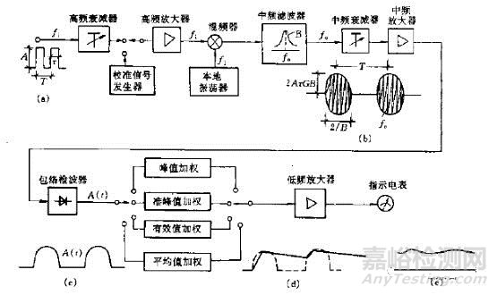          
  其电路结构类似于半导体收音机。测量时先将测量仪调谐，对准某个频率fρ。该频率经高频衰减器和高频放大器后进人混频器，与本地振荡器的频率fl混频，产生很多混频信号。经过中频滤波器以后仅得到中频f0＝fl－fi。中频信号经中频衰减器、中频放大器后，由包络检波器进行包络检波，滤去中频得到其低频包络信号A（t）。A（t）再进一步进行加权检波，加权可根据需要获得A（t）的峰值（Peak）、有效值（rms）、平均值（Ave）或准峰值（QP），这些值经低频放大后可推动电表指示。测量前如果用校准信号发生器的信号进行预先校准， 则可以直接读数。骚扰信号的读数等效于正弦信号的有效植。     
  由于很多骚扰都是脉冲性的，所以骚扰测量仪应能测量脉冲信号，这是它与一般电压表的不同之处。设输入信号是幅度为A、宽度为τ、周期为T的脉冲信号。由图3可见其中频信号波形\[（b）点]为载波频率为中频f0的调幅信号，其包络幅度为2AτGB，G为中频放大器和以前各级电路的增益，B为中频带宽；包络主瓣宽度为2/B，两个主瓣之间间隔为T．包络检波器后的波形\[（c）点]只不过是滤去中频载波后的中频包络。由于包络的宽度和幅度都与中频带宽B有关，因此测量仪的中频带宽一定要有统一的规定。 否则对于同一脉冲信号，由于中频带宽不同，测量结果可能不同，这是与仅能测量正弦波的电压表的一个不同之处。     
  对同一个脉冲输人信号的中频输出波形进行不同形式的加权检波，可能得到不同的值，一般包络的峰值＞准峰值＞有效值＞平均值。骚扰测量中的发射限值（即标准允许的最大骚扰发射量）绝大多数都是以准峰值形式规定的，因为准峰值可以反映人耳或人眼对脉冲骚扰的响应，当脉冲很快上升时，人耳不能立即反应，当脉冲跌落后，人耳的感觉仍有滞留效应。加权检波的形式是由检波电路的充放电时间常数决定的，充电慢、放电快得到的加权值就越低，所以对准峰值的充放电时间也要有统一规定。这是与仅能测量正弦波的电压表的又一个不同之处，因为对于正弦波输人信号，其中频输出波形的包络的峰值、准峰值、有效值、平均值都是相等的。     
  图中（d）点的波形是准峰值加权波形，（e）点是电表读数。由于电表具有一定的惯性（即电表机械时间常数）所以电表读数将受一定影响，因此标准规定电表应处于临界阻尼状态，并具有确定的机械时间常数。虽然现在大多使用数字化电表，该指标仍然保留，只要在A/D变换器后加一个二阶低通滤波器即可。    
  由于骚扰测量仪以测量脉冲信号为主，脉冲幅度往往很大，所以测量仪还应该具有较大的过载能力，以免把脉冲顶部削掉。     
  综上所述，骚扰测量仪必须具有统一的中频带宽、检波器充放电时间常数、电表机械时间常数和过载系数，这样才能保证在测量同一脉冲信号时得到一致的结果。表2为GB/T6113.1规定的骚扰测量仪指标。其中各频率段的范围为：        
  - A频段——9～150kHz；
  - B频段——0.15～30MHz；
  - C频段——30～300MHz；
  - D频段——300～1000MHz；      
  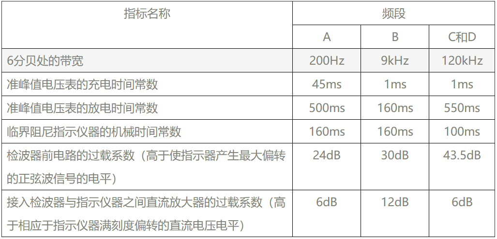    
  为了鉴别骚扰测量仪是否达到了表2规定的四大类指标，标准又进一步规定了骚扰测量仪的绝对脉冲特性和相对脉冲特性。所谓绝对脉冲特性指输人规定的周期脉冲信号时骚扰测量仪的读数应达到规定的值。绝对脉冲特性见表3。    
  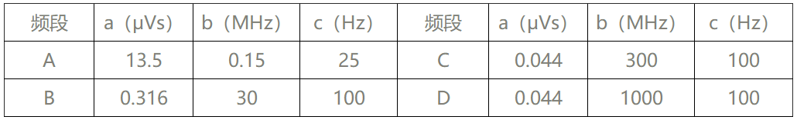    
  表3的含义是：在A、B、C、D各频段内，分别输入各自的标准周期脉冲，要求脉冲的幅度×宽度等于a（μVs），重复频率为c（Hz），该周期脉冲的频谱至少应该在b（MHz）以下是均匀的，脉冲信号发生器的源阻抗应和骚扰测量仪输入阻抗相等。对于该输人信号，骚扰测量仪在该频段的任何频率上的读数都应该等于60dB（μV）。   
  所谓相对脉冲特性指输人周期性脉冲信号时，脉冲的重复频率越高，其读数越高，重复频率低，读数低。当读数不变时输人脉冲的幅度和重复频率的关系应符合表4的规定。     
  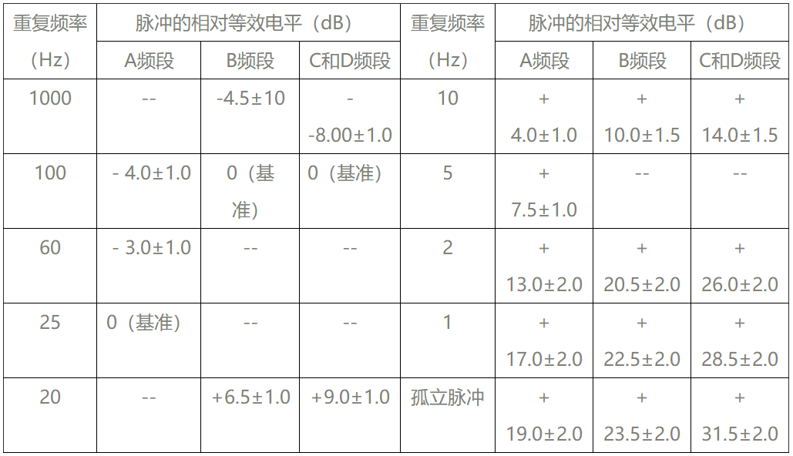     
  表4中各频段的输入脉冲的相对等效电平，以绝对脉冲特性中的该频段的标准周期脉冲的幅值为基准（定义为0dB）。如果骚扰测量仪的绝对脉冲特性和相对脉冲特性都符合表3和表4的要求，则说明该骚扰测量仪的四大类指标基本符合表2的要求。    
  骚扰测量仪除了具有准峰值测试功能外，一般还具有峰值和平均值测试功能，峰值检波器的放电时间常数(TD)和充电时间常数（TC）的比值要远远大于准峰值检波器，各项段的TD/TC值如表5所示。     
  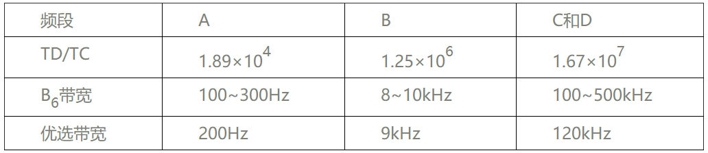      
  峰值测量时中频带是可以选择的，其选择范围和优选值如表5所示，在给出骚扰电平时应标明所选带宽。对于非重叠骚扰，指中频段输出波形中的各个主瓣不重叠，见图3中（b）点波形，由于峰值测量结果和带宽成正比，所以测量结果也可用对于1MHz带宽的归一化值V1MHz (dBμＶ/MHz)来表示。      
  V1MHz (dBμＶ/MHz)═Ｖ(dBμ)+20lg 1MHz/Bimp
  式中Bimp为脉冲带宽,与6dB带宽B6 的关系为Bimp =1.05 B6。Ｖ(dBμ)为使用Bimp带宽时的峰值测量读数, 20lg 1MHz/Bimp为1MHz和Bimp的比值的对数。峰值测量所需的过载系数比峰值测量小的多，检波器前电路的过载系数只需比1稍大些即可。        
  峰值测量时的绝对脉冲特性的含义和准峰值测量是相同的，只不过输入的标准脉冲强度不同，标准规定为脉冲幅度×宽度=1.4/Bimp(mＶs), Bimp单位为Hz ,具体数值见表6。对于标准脉冲输入,测量仪在该频段上的任何频率上的测量结果均应该等于60dB(μＶ)。       
  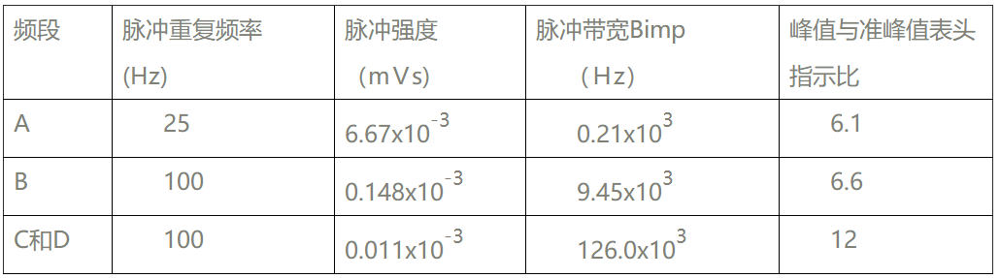     
  骚扰测量仪可以进行准峰值测量、峰值测量和平均值测量。当输入信号是正弦波时，无论用何种方式测量，得到的读数都是相同的，等于该正弦波的有效值，精度应优于±2dB。但是如果输入的是周期脉冲信号，则三种测量方法得到的读数是不一样的，其结果如表7所示。    
  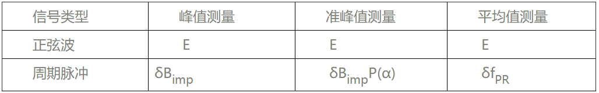      
  - E——正弦波的有效值；
  - δ——脉冲强度，等于脉冲幅度×脉冲宽度，单位：mＶS
  - Bimp——脉冲宽度；Bimp=1.05B6
  - fPR——脉冲重复频率；
  - P(α)——准峰值检波效率，与检波器的充、放电时间常数、脉冲重复频率和带宽有关，P(α)≤1。    
  由表7可知，峰值测量结果≥准峰值测量结果。表6中列出了输入标准脉冲，在标准宽带情况下峰值与准峰值表头指示之比值。表8列出了具有相同带宽的准峰值和平均值表头指示之比值，由表可知，准峰值≥平均值。对于规则的周期性脉冲可以根据表7来进行峰值、准峰值、平均值之间的转换。但是一般骚扰都是随机的，很难进行彼此间的换算，因此有些标准同时规定了发射测量的准峰值限值和平均值限值。    
  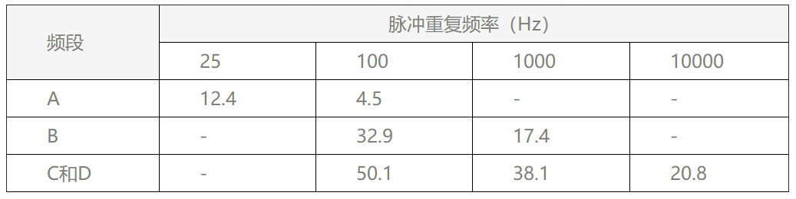      
  在准峰值测量时，如想要在某个频率点得到较稳定的测量值，则测量时间应大于检波器充放电时间和电表机械时间常数之和，并且测量不止一个周期，所以一般准峰值测量时间要求比较长。如果测量仪具有扫频测量功能，则设置的扫描时间应符合表9的规定。在实际测量中，往往先用峰值进行全频段测量，然后再对超过限值的频率点进行准峰值测量，这样可以大大节省测量时间。      
  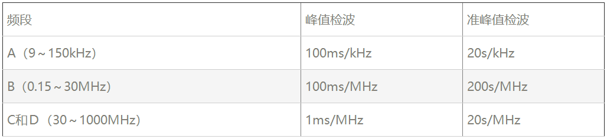       
  综上所述骚扰测量仪由于规定了四大类指标和二个脉冲特性，所以可以测量脉冲信号和正弦信号，在测量正弦信号时无论采用哪一种检波方式，结果都是一样的。一般的电压表（包括场强仪）仅能测量正弦波，不能测量脉冲信号。骚扰测量仪目前市场上有二种基本类型，一种是测量接收机类型，它是单频点测量，灵敏度较高，自动化程度高的可以自动扫描各频点。另一种是频谱分析仪类型，可以显示整个频段，但灵敏度稍低些。但是无论什么类型的测量仪，只有符合GB/T6113.1规定的四大类指标和二个脉冲特性后才能进行EMI测量。     
  - 测量用天线    
  天线用来接收骚扰电磁场，把场强转变成电压，骚扰测量仪测量的是转变后的电压值，所以测量仪的读数只有加上天线系数后才能得到骚扰场强，如果连接天线和测量仪的同轴电缆有损耗，则还应加上损耗值，即       
  骚扰场强\[dB（μV／m）]＝测量仪读数\[dB（μV）]十天线系数（dB）＋电缆损耗（dB）     
  每部天线都有天线系数，该系数与频率有关，曲线一般由天线制造商给出。电磁骚扰测量中常用的天线为宽带天线，便于自动化扫频测量。一般用双锥天线（30～300MHz）和对数周期天线（200～1000MHz），最近又推出把二种天线合二为一的宽带天线（30～1000MHz）。在测量1GHz以上的频率时常用喇叭天线，喇叭天线具有很强的方向性。有时EMI测量也用对称振子天线，其长度应该等于被测频率的半波长，由于改变测量频率时需同时改变振子长度，所以这种天线不适合进行自动化扫频测量。以上这些天线的形状见图4。        
             
  1GHz～18GHz频率段的辐射发射测试一般使用全电波暗室，现以工科医（ISM）设备为例说明。由于试验场地是自由空间，只有直达波，没有反射波，所以接收天线可以设置在与EUT同一高度上，不必上下移动。但是转台仍需360度转动，以获得最大值。测试距离为3米。天线应采用小口径定向天线，水平和垂直二种状态都要测试。测量采用频谱分析仪，因为工科医（ISM）设备在运行期间工作频率可能会有明显变化，所以采用全景分析比较适宜。频谱分析仪应设在最大保持方式和对数dB显示方式。测量结果用电场强度的峰值或平均值表示（不用准峰值）。峰值测量时采用1MHz的分辨率带宽和视频带宽，平均值测量时仍采用1MHz的分辨率带宽，但是视频带宽应大大缩小至10Hz，相当于加入一个低通滤波器。     
  辐射发射测试时,测量天线接收到的骚扰强场包括两个部分,一部分是EUT内部的导线和电路直接通过机箱壳体的缝隙向外的辐射,称壳体辐射，另一部分是由外接电缆引出的共模电流辐射。替代法测试的目的是仅仅测试EUT的壳体辐射,所以要求拆除所有可以拆卸的电缆,不能拆卸的电缆上要加铁氧体磁环,并放在不会影响测量结果的位置上。     
  图7所示为替代法测试的方法和布置。首先用半波振子天线A和测量接收机测量出EUT的最大骚扰值，然后用半波振子天线B替代EUT。调节信号发生器输出功率，直至测量接收机达到同样的值。记录替代天线B的输入端功率，即为EUT的壳体辐射功率。     
      
  由于采用替代法，所以对试验场地的要求比较宽松,只要求替代天线B在各方向上移动±10cm，测量值变化不超过±1.5dB既可。合格的开阔场地、半波暗室和全电波暗室都符合上述要求，都可以进行替代法测试。     
  测试天线A的高度h应和EUT中心的高度相同，只要求h>1m，测试天线A也不需上下移动。但要求EUT在常规放置位置和90o翻转位置上分别旋转翻360o，以便寻找EUT的最大骚扰值。     
  测试距离d虽然没有明确要求，但最好还应符合远场条件。d的起始点为EUT的几何中心，终止点为测量天线A的天线中心。替代试验和校准试验时，替代天线B应置于EUT 的几何中心。    
  对天线的要求：在30MHz～1GHz频段，测量天线A可采用半波振子天线，也可采用宽带天线，但替代天线B则必须用半波振子天线。1GHz～8GHz 都用线性极化的喇叭天线。     
  替代法的校准很重要。一般水平极化和垂直极化状态都要进行校准。校准时发射天线B与测量天线A平行放置，对于每个频率点，都要记录发射天线的输入功率和测量接收机的接收电压的关系曲线，找出校准系数K（f）。以后测试时就可以直接将测到的最大骚扰电压加入校准系数K（f）后得到壳体辐射功率，不必再做替代试验。     
  9KHz～30KHz频段用环型天线测量EUT辐射的磁场分量。测量方法有两种：一种是大环天线（LLA）法，见图8；一种是远天线法。采用何种方法主要是由EUT的尺寸决定的，例如对于工科医（ISM）设备，国标GB4824规定，直径为2m的LLA可测量的最大设备其对角线尺寸不应超过1.6m。大环天线法比较好，因为EUT的三个正交磁偶极距的磁场分量都可以测量，三个环上都有电流探头，测量结果用大环上的磁感应电流dB(μA)表示。大环的标准直径为2m，也可用1、1.5、3和4m直径的大环，但结果都应转换到2m大环上，以便和标准规定的限值比较。大环天线（LLA）测量系统应使用规定的标准天线进行校准，所以大环法也可以视做某种替代法，即EUT的磁场辐射强度等效于标准天线的辐射强度。如果EUT太大无法使用LLA法，则应采用远天线法。例如国标GB4824规定，尺寸超过1.6m的家用感应炊具的辐射磁场测量，使用直径0.6m的单小环天线，测量距离3m。单小环天线垂直地面放置，最低部高于地面1m（典型值），所以测量得到的是环天线处的磁场的水平分量，但是由于测量处于近场条件，地面又有反射，所以测量所得的值仍然反映了EUT的水平和垂直偶极距的情况。     
  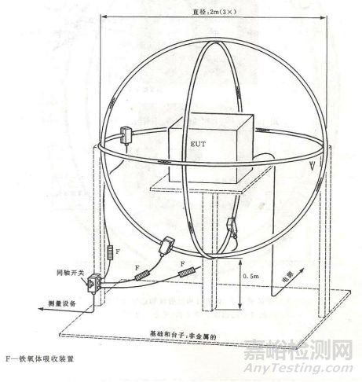      
  
  

	
	