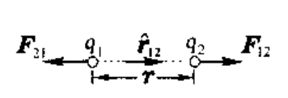

**库仑定律**：在***真空***中，两个***静止***的***点电荷***和之间的相互***作用力的大小***和与的乘积成正比，与它们之间的距离平方成反比；***作用力的方向***沿着它们的联线，同号电荷相斥，异号电荷相吸。    
- 关于真空：真空这个条件并不是必须的，就是为了简便而已，如果中间有其他物体，从微观角度考虑，无非就是有其它电荷的存在，但是这并不影响原来的电荷之间的相互作用，这是由叠加原理来保证的。  
- 关于静止：静止条件则是必须的，而且是一个很强的限制。库仑定律要求两个点电荷静止（相对于观察者），说明库仑定律不遵循力学中的相对性原理。但这个静止条件是可以稍微放宽一点的，如果一个点电荷运动起来，另一个点电荷静止。如果考虑一个静止的点电荷对一个运动的点电荷的作用，库仑定律仍然成立，但是反过来一个运动电荷对静止电荷的作用是不满足库仑定律的。这说明，一个运动电荷和一个静止电荷之间的相互作用是不满足牛顿第三定律的。牛顿第三定律是由动量守恒得到，说明这两个点电荷是不满足动量守恒的，显然动量守恒是不会错的，说明这两个点电荷之间另有第三者介入，现在引起了第三者动量的变化，这个第三者就是场。  
- 关于点电荷：如果两个带电体不是点电荷，而是有具体形状和大小，那么两个带电体之间的作用力不仅与两个物体的距离有关，还与带电体的形状和大小有关，库仑定律是不可以直接使用的。点电荷是一种抽象的物理模型，如果电荷的大小对所研究问题的结果带来的影响微不足道，这个时候就完全可以把电荷的体积和大小忽略掉，把电荷看做只有电量，没有大小的电荷，这就是点电荷模型。实际的带电体(包括电子、质子等)都有一定大小，都不是点电荷．当电荷间距离大到可认为电荷大小、形状不起什么作用时，可把电荷看成点电荷。   
- 关于作用力的方向沿着它们的联线：不沿径向不满足空间对称性的要求。电荷本身是无方向性的，所以如果二者力的作用不在径向上，那你在不同方向上观察力的方向就会是不同的。
- 补充：
  - 相对性原理：力学定律在一切惯性参考系中都具有相同的形式，任何力学实验都无法区分静止和匀速直线运动的惯性参考系。或者更加简单的说：力学定律对于一切惯性系都是等价的。通俗地讲就是在封闭船舱里发生的任何力学现象，都无法确定船是在匀速运动还是在静止不动。  
  - 惯性系：惯性参考系（常简称为惯性系）是指可以均匀且各向同性地描述空间，并且可以均匀描述时间的参考系。在惯性参考系内，系统内部的物理规律与系统外的因素无关。所有的惯性系之间都在进行匀速平移运动。不同惯性系的测量结果可以通过简单的变换（伽利略变换或洛伦兹变换）相互转化。  
  - 牛顿第三运动定律：相互作用的两个物体之间的作用力和反作用力总是大小相等，方向相反，作用在同一条直线上，表达式为。  
  - 动量守恒：一个系统不受外力或所受外力之和为零，这个系统的总动量保持不变，这个结论叫做动量守恒定律。  
  - 关于空间对称性：自然界的规律是分层次的，包括空间旋转对称性在内的对称性原理凌驾于库定律、高斯定律、万有引力定律等各种物理规律之上。具体物理受之约束，不得违背。对称性不能用严格的方法证明，而是以公理化的假设形式出现。       
----
**库仑定律的数学表达式为**  
  
令代表给的力，代表两电荷间的距离，代表由到方向的单位矢量。  
无论、的正负如何，此式都适用。当，同号时，沿方向，即为排斥力；当，异号时，沿方向，即为吸引力。
当下标1,2对调时，，
故公式还表明给的力
，即静止电荷间的作用力满足牛顿第三定律。如图  
  
式中是比例系数，它的数值取决于式中各量的单位。  
- CGSE单位制：很多文献中常采用的一种电学单位制，称为厘米·克·秒静电单位制，通常以CGSE或e.s.u.表示，在此单位制中是库仑定律的公式中等于1（无量纲），并由此来定义电量的单位，
具体表述为令，并设，且
，而相互作用力为时，
则每个点电荷的电量为1CGSE，称为1静库。   
- MKSA单位制：目前公认的国际单位制（SI）的一部分。有四个基本量：长度、质量、时间和电流。长度以米（M）为单位，质量以千克（K）为单位，时间以秒（S）为单位。电流以安培（A）为单位。在此单位制中电量的单位是C（库伦），其定义为
如果导线中载有1A的恒电流，则在1s内通过导线横截面的电量为1C，即。  
- 在MKSA单位制中K被写为的形式，其中
是物理学中的一个基本物理常量，叫做真空电容率或真空介电常量。
因为，那么
  
- 补充：
  - 一个电子所带的电量为e，每个原子核，原子或离子、分子，以致宏观物体所带的电量，都只能是这个基元电荷e的整数倍。这个常量是由试验测定的，根据1999年发布的数据，这个基元电荷的量值为。  
  - 关于叠加原理：在库仑定律中，如果保持其中一个电荷不变，而将另一个电荷增大数倍，那相互间的作用力也将增大同样的倍数。这一事实表明，在库仑定律中暗含着电荷在效果上是可加的。既然电荷具有可加性，则可将其中一个电荷分为若干个电荷，并都放置在其所在的位置上。所以库伦定律可以写为  
    
  这表示，两个电荷之间的库仑力不因第三个电荷的存在而改变，所以库仑定律满足叠加原理。  
  