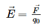

1. 电荷之间的作用力是通过什么来做用的呢？电荷之间的作用力是通过电场来作用的。
2. 为了对电场进行研究，引入了电场强度矢量，电场的一个重要性质就是它对电荷施加作用力，可以以此来定量描述电场。
3. 电场强度：定义  
        
电场强度反映了电场本身的性质，是与试探电荷q0无关的一个矢量，其大小等于单位电荷在该处所受电场力的大小，其方向与正电荷在该处所受电场力的方向一致。  
4. 匀强电场：如果空间中各点场强大小和方向都相同，这种电场叫做匀强电场。  
5. 电场强度的单位为N/C，或者为V/m。  
