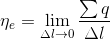
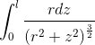
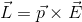

1. 电荷之间的作用力是通过什么来做用的呢？电荷之间的作用力是通过电场来作用的。
2. 为了对电场进行研究，引入了电场强度矢量，电场的一个重要性质就是它对电荷施加作用力，可以以此来定量描述电场。
3. 电场强度：定义  
        
电场强度反映了电场本身的性质，是与试探电荷q0无关的一个矢量，其大小等于单位电荷在该处所受电场力的大小，其方向与正电荷在该处所受电场力的方向一致。  
4. 匀强电场：如果空间中各点场强大小和方向都相同，这种电场叫做匀强电场。  
5. 电场强度的单位为N/C，或者为V/m。 
6. 点电荷的场强：   
点电荷具有如下特点：
- E的方向处处沿以q为中心的矢径（q>0）或其反方向（q<0）；
- E的大小只与距离r有关，所以在以q为中心的每个球面上的场强的大小相等。通常说，这样的电场是球对称的。
- E与r2成反比，当r→∞时，E→0。  
7. 场强叠加原理：点电荷组所产生的电场在某点的场强等于各点电荷单独存在时所产生的电场在该点场强的矢量叠加，称为场强叠加原理。  
8. 电偶极子的电场，如图，分别求其中垂线上一点P'和延长线上一点P的场强。  
   
- 对于延长线上：正电荷在P点产生的场强，
负电荷在P点产生的场强，
那么P点的总场强为。  
因为<a href="https://www.codecogs.com/eqnedit.php?latex=\frac{1}{\left&space;(&space;r-\frac{l}{2}&space;\right&space;)^{2}}-\frac{1}{\left&space;(&space;r&plus;\frac{l}{2}&space;\right&space;)^{2}}=\frac{\left&space;(&space;r&plus;\frac{l}{2}&space;\right&space;)^{2}-\left&space;(&space;r-\frac{l}{2}&space;\right&space;)^{2}}{\left&space;(&space;r-\frac{l}{2}&space;\right&space;)^{2}\left&space;(&space;r&plus;\frac{l}{2}&space;\right&space;)^{2}}=\frac{2lr}{\left&space;(&space;r^{2}&space;-\frac{l^{2}}{4}\right&space;)^{2}}" target="_blank"></a>  
如果，则上式可近似化为
，故   
。  
- 对于中垂线上：正电荷在P'产生的场强，
对于负电荷在P'产生的场强，
那么总场强为且
，同时
故
，
因为，那么
，
当时，
，
则。  
综上：  
- 电偶极子的场强与距离r的三次方成反比，它比点电荷的场强随r递减的速度快得多。
- 电偶极子的场强只与q和l的乘积有关。譬如q增大一倍而l减少一半，电偶极子在远处产生的场强不变。
- q和l的乘积是描述电偶极子属性的一个物理量通常叫它电偶极矩，用p表示，即p=ql，通常l是从负电荷指向正电荷，即，那么电偶极子延长线和中垂线的场强为：
  
式中，上面为延长线上的场强，下面为中垂线上的场强。这里只给出了两个特殊未知的场强。  
9. 电荷的连续分布  
从微观结构来看，电荷集中在一个个带电的微观粒子（如电子，原子核等）上边。但从宏观效果来看，人们往往把电荷看作是连续分布的。根据不同的情况，有时把电荷看成在一定体积上连续分布（体分布），有时把电荷看成一定曲面上
连续分布（面分布），有时把电荷看成一定曲线上连续分布（线分布），等等。因此，需要引入电荷的体密度，面密度和线密度等概念。  
体密度的定义为：  
   
应该指出的是，这里“△V→0”是一种数学上的抽象，实际上只要△V在宏观上看起来足够小就行，但在其中还是包含了大量的微观粒子，∑q就是它们带电量的代数总和。由此可见，电荷体密度的概念实际上包含了对一定的宏观体积取平均的意思，
平均的结果便从微观的不连续过渡到宏观的连续分布。  
电荷的面密度的定义：  
     
和△V一样，△S也应是微观看很大，宏观看很小的。  
线密度的定义：  
   
同理，△l也应微观看很大，宏观看很小的。   
10. 如图，求P点的场强，设棒长为2l，带电总量为q。  
   
根据已知条件，可得细棒的电荷线密度为  
  
设距O点为Z的有一小段dz对P点产生的电场为  
   
此电场强度可以分为平行于棒和垂直于棒的分量，根据对称性，可以得到平行于棒的分量相互抵消为0，则只剩垂直于棒的分量。即   
   
则整个棒产生的场强为  
   
利用变量代换法，设z=rtanθ，可求得  
   
的积分为  
  
即求得整个细棒的场强为  
  
当细棒为无限长时，任何垂直于它的平面都可看成中垂面。所以无限长细棒周围任何地方的电场都与棒垂直。上面的结果，取l→∞时的极限，即得这时的场强为   
   
上式表明，E与r成反比。对于有限长细棒来说，在靠近其中部附近区域（r远远小于l)也近似成立。   
11. 电偶极子在匀强电场所受到的力矩。  
如图，力矩为力臂沿转动轴垂直于力方向的分量。正负电荷对力矩均有贡献，它们产生的总力矩为   
   
  
用矢量式表示为
  
又因为电偶极矩  
   
为从负电荷指向正电荷，所以电偶极子所受力矩又可写为   
   
 

