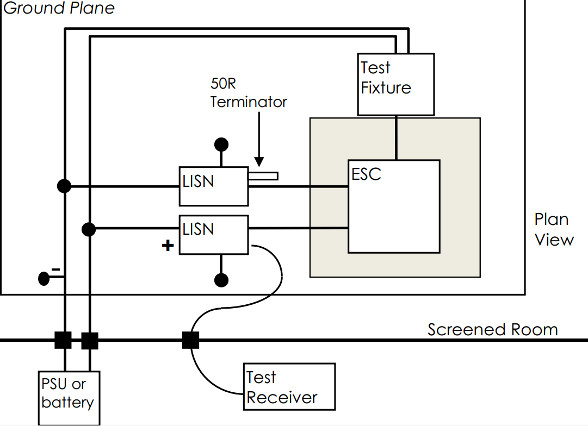

1. 传导发射测试介绍      
- 定义     
传导发射（Conducted Emission），简称CE，也被称为传导骚扰，是指电子、电气设备或系统内部的电压或电流通过信号线、电源线或地线传输出去而成为其他电子、电气设备或系统干扰源的一种电磁现象。几乎所有具备电源线的产品都会涉及到传导发射测试。传导发射通常用骚扰电压或骚扰电流的限值来表示，主要测量频率在150KHz到30MHz的范围。       
- 实验目的       
传导发射（CE）测试主要测试电子、电气设备或系统在正常工作时自身的电压电流通过信号线、电源线或地线传输出去而对其他设备造成的干扰强度，测试这些骚扰量是否超过标准要求的界限值。与辐射发射类似，通过将试验测量值与限值比较来判断EUT的传导发射是否合格，测量值低于限值则PASS，反之则FAIL，以此保证在公共电网上工作的其他设备免受干扰。     
Tip：不同类型的产品可能有不同的限值，具体数值要结合我们讲过的产品专用标准或产品类标准来查找确定。           
- 实验设备和条件     
  - 测量接收机     
  测量接收机是EMI测试中最常用的基本测试仪器，仪器类型包括准峰值测量接收机、峰值测量接收机、平均值测量接收机和均方根值测量接收机。测量接收机的几个重要指标分别是：6dB处的带宽、充电时间常数、放电时间常数、临界阻尼指示器的机械时间常数、过载系数。      
  - 人工电源网络（AMN）或线性阻抗稳定网络（LISN）     
  线性阻抗稳定网络LISN（Line Impedance Stabilization Network）也叫做人工电源网络AMN（Artificial MainsNetwork），LISN是一种耦合去耦电路，主要有以下作用：      
    - 将EUT与电网隔离开来，为EUT提供纯净的交流或直流电源；    
	- 通过耦合电容把EUT的骚扰信号耦合至测量接收机进行测量，使EUT的骚扰信号不会反馈到电源端；    
	- 提供规定的阻抗（一般为50Ω）。    
    对于低频信号，LISN的电感表现为低阻抗，电容表现为高阻抗，所以信号经过LISN基本不衰减，电源可以经LISN输送到开关型变换器；而对于高频信号，LISN的电感表现为高阻抗，电容可以视为短路，所以LISN阻止了高频噪声在EUT和电网之间的传送。连接测量接收机时，仪器内部标准阻抗为50Ω，共模和差模干扰电流将从该50Ω阻抗上流过，此时，LISN起到了为共模和差模干扰电流在所需测量的频段提供了一个固定阻抗（50Ω）的作用，而50Ω电阻上的电压就是传导骚扰电压。       
    EUT产生的干扰电流包括两种模态：差模电流从火线流出到中线，共模电流经过火线和中线到地线；因此，火线和中线中的差模信号的幅值相同，相位相反，而共模信号是幅值和相位都相同。在总的传导干扰信号中，设备中的共模和差模噪声具备不同的特性，滤波器的设计方法也由此各不相同，必须被分别抑制。然而这个线性阻抗稳定网络只能测量电源线上总的传导干扰，并不能测出其中的共模和差模分量。因此，在实际的传导发射测试中，依具体的测试结果及显示要求的不同，可以对这个基础的线性阻抗稳定网络进行处理，得到改进的线性阻抗稳定网络。      
    另外使用LISN测量传导干扰需特别注意过载问题，EUT因开关或瞬时断电会引起瞬态尖峰，其幅度远远超过接收机的电压测量范围，很容易损坏接收设备，由于测试接收机的价格不菲，因此需在接收设备前端加过载保护衰减器，并且最好在EUT通电、调试好之后再接上测试设备。     
    使用LISN测量尖峰干扰信号时，因为尖峰干扰电压的幅度较大，如AC220V电源线的开关动作产生的瞬态电压尖峰可能达到近400V。而尖峰信号通常在开关、继电器闭合瞬间出现，属于瞬态干扰，故测量过程中要不断做开关动作，通过具有一定带宽的带存储功能的示波器捕捉和测量，使其最大值与规定限值进行比较。     
    标准中规定A频段 (9~150kHz) 和B频段 (150k~30MHz) 分别使用50Ω|50μH+5Ω 和 50Ω|50μH两种V型网络。     
    LISN的主要指标包括：频率范围；阻抗；分压系数；相角；隔离度等。以罗德与施瓦茨的ENV216型号为例，ENV216的特点：       
    - 频率范围：9kHz～30MHz
    - 最大恒定电流16A
    - 模拟阻抗(50μH+5Ω)||50Ω满足CISPR16-1-2AMD.2：2006.
    - V型网络满足CISPR，EN，VDE，ANSI，FCCPart15和MIL-STD-461D，E和F
    - 标准满足CISPR16-1-2和ANSIC63.4       
	ENV216的优点：       
	- ENV216基于空心电感线圈设计，包含人工模拟手；
    - 使用150kHz高通滤波器，可避免由于低频高电平引起的测量接收机过载；
    - 不论接收机输入衰减大小，为了保证标准阻抗，ENV216内置10dB衰减器；
    - 内置脉冲限幅器，保护接收机输入；
    - 由控制器和R&S测量接收机产生的输入由TTL电平控制。     
  - 电流探头    
  电流探头的应用十分广泛，主要是利用流经导体的电流会在周围产生磁场，该磁场会被另一线圈感应这一互感原理制造的，电流探头把磁场转化成相应的电压信号，和示波器配合，通过电流探头转换系数将接收到的电压转换为电流，即可得到不同频率上干扰电流的幅度值。     
  电流探头分成AC电流探头和AC/DC 电流探头，AC 电流探头常见的是无源探头，成本低，但不能处理直流分量；AC/DC 电流探头通常是有源探头，分为低频探头和高频探头，低频探头常见的带宽在几百KHZ 以下，高频探头带宽一般在几MHZ 以上。       
  电流探头重要指标主要有以下几类，购买时也可参考：    
    - 精度：是指电流到电压转换的精度。拿 AC/DC 电流嵌为例，一般开环系统的精度比较差一点，典型值在3%左右；闭环系统的精度比较高，典型值在1%左右。      
    - 带宽：所有探头都有带宽。探头的带宽是指探头响应导致输出幅度下降到70.7%(-3dB)的频率。      
    为精确地测量上升时间和下降时间，我们使用的测量系统必需使用拥有充足带宽的探头，可以保持构成波形上升时间和下降时间的高频率成份。比如使用测量系统的上升时间时，系统的上升时间一般应该比要测量的上升时间快4-5倍。      
    在幅度测量中，随着正弦波频率接近带宽极限，正弦波的幅度会变得日益衰减。在带宽极限上，正弦波的幅度会作为实际幅度的70.7% 进行测量。因此，为实现最大的幅度测量精度，必需选择带宽比计划测量的最高频率波形高几倍的示波器和探头。这同样适用于测量波形上升时间和下降时间。波形转换沿(如脉冲和方形波边沿)是由高频成分组成的。带宽极限使这些高频成分发生衰减，导致显示的转换慢于实际转换速度。       
    - 插入损耗：插入阻抗是从电流探头的线圈(二级)转换到被测的携带电流的导线中的阻抗。插入损耗是指在发射机和接收机之间，引入其他器件导致的信号衰减量，通常用dB单位表示。插入损耗的表达公式如下：        
    插入损耗（Insertion Loss）= 20lg(Ur/Ut)，Ut为发射信号，Ur为接收信号。      
  - 电压探头    
  在不能使用LISN时会考虑使用电压探头，电压探头主要由隔直流电容器和一个电阻器组成，使线路和地之间的阻抗至少为1.5kΩ。且应保证电容器或其他任何保护测量接收机抵御危险电流的装置对测量结果的影响小于1dB。     
  - 屏蔽室    
  - 模拟手（选用）    
  为了模拟使用者手的感应，当手持式设备进行电源端子骚扰电压测量时，需要用到模拟手，非手持式设备无需用到。       
  模拟手是一个规定尺寸的金属箔（带），它按规定的方式放在或缠绕在设备上通常被使用者接触的部分，一般采用铜箔，厚度为0.05mm，宽度为60mm，长度为150mm-200mm，金属箔按照规定的方式借助一个RC组件连到测量系统的参考点，该组件由一个个C=220pF±20%的电容串联一个510Ω±10%的电阻组成，模拟人体的RF阻抗。    
       
  使用模拟手的一般原则是：无论手柄是固定的还是可拆卸的，金属箔应包裹EUT所有的手柄（每个手柄使用一个金属箔）。      
  当EUT罩壳全部为金属时，不需要金属箔，RC单元的M端直接接到设备壳体上；当EUT罩壳为绝缘材料时，金属箔应围绕手柄包裹。     
  -环境要求     
    - 台式设备试验布置图如下       
          
      - EUT应放在距离地面80~90cm高的非导电桌上;    
      - 超长的电缆要进行捆扎，折成30~40cm的线束，若由于特殊原因不能这么做，则应在报告详细说明电缆布置情况；     
      - 不用的I/O信号电缆末端接终端电阻，进行终端匹配，不能悬空，这一点尤其重要；    
      - EUT与LISN/AMN之间的间隔在地面上的投影距离应至少为80cm；       
      - 所有的电缆与GND之间的间距在10cm以上；      
      - 悬垂电缆末端距GND为40cm以上，以保证不会有过分的空间耦合。      
      - 在屏蔽室内测量时，可用地面或者屏蔽室的任意一壁作为接地平面（GND）。       
    - 落地式设备试验布置图如下：     
          
    落地式设备距离LISN80cm，EUT与辅助设备放置在距离GRP 0.1m的非导电桌上。	     
  - 举例
    - 设备的分组    
	与辐射发射类似，先对EUT进行分组分类，因为不同组别和类别的限值会不同。      
	- 设备的分类     
	A类：非家用和不直接连接到住宅低压供电网设施中使用的设备。       
    B类：家用和直接连接到住宅低压供电网设施中使用的设备。       
	- 试验依据：针对具体实验和场地选择等。      
	- 限值：一般会针对不同的功率有不同的限值。无适用限值则指不进行此频段测试。裕量指实际测量值与限值的差。        
	- 关于电压法和电流法：     
	传导发射英文简称CE，检测的是产品对外的传导干扰。传导干扰分为电压法和电流法。电压法测试的电源线对外的传导干扰，电流法测试的信号线对外的传导干扰。国际标准参考CISPR25，国标参考GBT18655。这个标准分为Class1~5一共5个等级，等级5的要求最严格，一般汽车行业会选Class3到Class5，很少看到选Class1 Class2的。当然很多车企都自己的企业标准。       
    传导发射测试的时候，一是要注意线束长度，比如电压法一般OEM要求200 mm，而GM要求1700mm，二是要注意是用两个LISN还是一个LISN，一般近端接地用一个LISN，即正极用一个LISN，远端接地一般都是用两个LISN。对于传导发射电流法测试还有一点需要注意，那就是一般标准要求电流钳套在所有线束上，而上汽标准要求电流钳只套在信号线上。这些细节都是测试的时候需要注意的。       
	CISPR25传导骚扰测试方法分为两种。一种是电压方法：电压测量只能用于单一导线的传导发射特性，故常用于测量电源线的发射，采用人工电源网络做隔离物；另外一种是电流探头方法：测量控制/信号线的发射。      
	      
	- 测试报告     
	      
  - 补充：干扰类型（干扰通常都是变化的，随机的，瞬时的）      
    - 差模干扰：加在两线之间的干扰（X电容）。        
	- 共模干扰：同时加在两线上的干扰（Y电容）。      
	- 近场干扰（感应干扰）：骚扰通过空间传输实质上是骚扰源的电磁能量以场的形式向四周的空间传播。场可分为近场和远场。近场又称感应场，近场的性质与场源的性质密切相关。如果场源是高电压小电流的源则近场主要是电场。
	如图是一信号源接到一短偶极子天线上，天线两极间有一定电压但电流较小，主要是空间的位移电流。在偶极子天线附近电场大于磁场。常用波阻抗来描述电场和磁场的关系，波阻抗定义为**Z0=E/H**。这里由于电场远大于
	磁场，所以波阻抗较高，因此电场源又称高阻抗源。随着离天线的距离增加电场和磁场都将减小，但是E∝1/r3，而H∝1/r2，因此波阻抗随距离增加而减小。    
	      
	如果场源是低电压大电流的源则近场主要是磁场。如图是一信号源接到一小环形天线上，天线中电流较大，天线周围的磁场大于电场，波阻抗低，所以磁场源又称低阻抗源。随着离天线距离增加，电场和磁场都减小，但是E∝1/r2，
	而H∝1/r3，因此波阻抗随距离增加而增加。     
	      
	无论场源是电场源或磁场源，当离场源距离大于λ/2π以后场都变成了远场，又称辐射场。这时电场和磁场方向垂直并且都和传播方向垂直的平面波。电场和磁场的比值为固定值，即波阻抗**Z0=120π=377(Ω)**，电场和磁场
	都以1/r速率随距离减小，所以远场也成为电磁场。综上，判定近远场的准则是       
	r＞λ/2π    远场；r＜λ/2π    近场            
	远场是平面波，比较容易分析和测量，只需测量电场就能算出磁场，反之亦然。近场比较复杂，电场和磁场不易互相转换，需要分别测量。同时由于近场场强和1/r2或1/r3有关，所以位置的微小变化
	都会引起较大的测量误差。对于距离较远的系统间的电磁兼容问题一般都用远场来分析。对于系统内，特别是同一设备内的问题基本上是近场耦合问题。      
2. 总结    
- 电气和电子设备在工作时所产生的电磁骚扰主要是由于其内部的各种电子线路、开关电源、电动机、机械开关和保护器的动作形成的。骚扰按沿电源线、信号线传播的传导骚扰，用骚扰电压（端子电压）度量。      
- 测量设备、设施及要求      
  - 测量接收机9kHz~30MHz，具有峰值、准峰值和平均值检波功能；能满足GB/T 6113.1要求。       
  - 人工电源网络（AMN）（电源端测量用），能满足GB/T 6113.1相应的阻抗特性曲线的要求。
    - 连接电源的电源端    
    - 连接受试设备的设备端      
    - 连接测试仪器的测量端      
           
    - 人工电源网络的作用       
      - 人工电源网络是电源端子传导骚扰电压测量的主要设备，又称线路阻抗稳定网络       
      - 能在射频范围内，在受试设备端子与参考地之间，或端子之间提供一稳定阻抗	       
	  - 同时将来自电源的无用信号与测量电路隔离开来，而仅将受试设备的干扰电压耦合到测量接收机输入端        
  - 电压探头和电流探头（不使用AMN测量时用）。 
    - 电流探头     
      - 电流探头是测量传导骚扰的一种特殊的测量设备       
      - 部分标准明确规定用电流探头测量传导骚扰         
      - 其优点是不需与源导线导电接触，也不用改变其电路       
      - 用专门改进的卡式电流传感器就可以测量线上的非对称干扰电流      
      - 对复杂的导线系统、电子线路等的干扰测量可以在不打乱正常工作或正常布置的状态下进行         
               
             	  
  - 阻抗稳定网络（ISN）（电信端口测量用）。       
  - 比EUT边框大0.5m的接地平板，最小尺寸为2m×2m。      
  - “干净的”三相电源，以便能够分别给测试系统、 EUT中的受试端口和支持设备（如辅助设备的电源端口）单独供电。         
  - 传导测试布置      
       
        
  - 传导测试程序        
  以台式EUT为例，给出一般的试验程序仅供参考。        
    - 严格按照产品标准中的布置图进行试验布置和连接；     
	- 测量环境电平，确认环境电平比相应限值低6dB；        
	- 按标准要求或其他要求选择相应的限值；      
	- 选择EUT的工作状态，并使之投入运行；      
	- 在150kHz～30 kHz频率范围内，依次对每根导线进行测量；       
	- 先进行初测，找出最大骚扰所对应的工作状态和频率；    
	- 进行最终测试，记录测量数据。         
  - 传导骚扰标准限值       
         
         
          
3. 举例      
- 电压法测试setup    
        
     
- 接收器的设置      
      
- 限值      
      
- 测试报告       
      
      
       
       
- 电流测试法Setup      
       
- 接收器的设置    
       
- 限值      
     
- 测试报告    
     
     
     
     
      
     

  
  