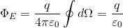

1. 立体角    
我们知道，球面的面积  
  
与半径r的平方成正比。  
所以，在空间取一点O，以它为中心做一半径r的球面，并以它为顶点做任意形状的锥面。锥面在球面上割出来的面元dS正比于半径r的平方，即二者之比是个常数，可作为锥面所张立体角dΩ大小的度量，这种立体角的单位叫做球面度（符号为sr）：   
   
立体角的球面度与平面角的弧度相对应。正像整个圆周对圆心所张平面角是2π弧度一样，整个球面对球心所张的立体角是4π球面度。    
证明：   
如图   
   
上图中的一小块面积等于：   
   
可以看出，dA2是球面上的一小块微元面积，整个球面的面积是对dA2的积分：   
  
立体角的定义是：   
    
所以总的立体角积分之和为：   
   
面元dS不一定与由顶点引出的矢径垂直。如果它是斜的，应计算它在垂直矢径方向的投影面积dS'=dScosθ，这里θ是dS的法线与矢径之间的夹角。如图：    
   
因而定义面元矢量    
   
其中，为面元dS的法线方向的单位矢量。这样面元既有大小又有方向，大小为dS，方向沿法向。    
这样，立体角就可写为    
    
式中，为单位矢量。和的指向选定后，矢径与它可能成锐角，也可能成钝角，因而依据上面的定义立体角就有可能有正有负。   
2. 电通量   
定义电通量     
  
表示E的有效值为E沿S方向的投影。   
通过面元S的电通量为每一个小面元的电通量的累加，即    
    
因为曲面有正反两面，所以通量有正负。一般取外法向矢量为正。   
3. 高斯定理   
通过一个任意闭合曲面S的电通量ΦE等于该面所包围的所有电量的代数和Σq除以ε0，与闭合面外的电荷无关。即  
   
通常把闭合曲面叫做高斯面。   
证明：     
- 通过包围点电荷q的闭合曲面的电通量都等于q/ε0，因为   
    
所以     
   
对于任意曲面，可以做包围曲面的一个大球，通过曲面微元的任意一个立体角均可投影到大球球面上，即任意闭合曲面的立体角和球面的立体角是等价的，均为4π。   
- 通过不包围点电荷的任意闭合面S的电通量恒为0    
如图所示，当点电荷在闭合面S之外时，从某个面元dS进入闭合面的电通量必然从另一个面元dS'上穿出。两面元的法线与场强之间的夹角一为钝角，一为锐角，故两面元对该点电荷所张的立体角dΩ、dΩ'数值相等，符号相反，
它们的代数和为0。所以整个闭合曲面S对它外部的点所张的立体角恒为0，因而外部点电荷通过它的电通量也恒为0。    
   
- 多个点电荷的电通量等于它们单独存在时的电通量的代数和。这可以根据场强的叠加原理来进行说明。   
3. 均匀带电球壳产生的电场    
根据高斯定理   
  
- 设场点在球壳外，则可以做一高斯面包围球壳，则   
   
- 如果场点在球壳内，此时高斯面内无电荷，即Q=0，则E=0。    
4. 均匀带电球体的电场分布。   
   
5. 无限长均匀带电细棒  
6. 无限大带正电的平面   
   
可知此电场为匀强电场，与距离无关。   
7. 一对带等量异号电荷的无限大平行平面之间的场强为σe/ε0，之外为0。分别由正的无限大和负的无限大叠加而来，之外的电场线正与负相互抵消。    
利用高斯定理求场强的关键在于对称性分析。   
- 关于对称性   
一个系统在任何操作或变换下的不变性，都是“对称性”，例如绕固定轴旋转的不变性是轴对称性，绕固定点旋转的不变性是球对称性，沿特定方向平移的不变性是平移对称性，等等。在对称的条件下，必然有对称的结果，例如绕固定轴旋转的不变性是轴对称性，绕固定点旋转的不变性是球对称性，沿特定方向平移的不变性是平移对称性，等等。在对称的条件下，必然有对称的结果，例   
点电荷具有球对称性，故电场的分布必然是球对称的，这便是“对称性原理”。除旋转、平移等操作外，还有一种几何变换具有特殊的重要作用，即“空间反射”操作，在空间反射变换下的不变性叫做镜像对称性。
对于极矢量，与镜面垂直的分量反向，与镜面平行的分量不变；而轴矢量恰恰相反，与镜面垂直的分量不变，平行分量反向。并且两个极矢量叉乘得到的是轴矢量。如下所示：   
   
取z轴作为镜面的法向，则     
    
即为轴矢量。    
8. 从高斯定理看电场线的性质  
- 电场线疏的地方场强小，密的地方场强大：取电场管任意的两个截面ΔS1和ΔS2，它们与电场管的侧壁组成一个闭合的高斯面。则通过此高斯面的电通量为ΦE=E1cosθ1ΔS1+E2cosθ2ΔS2，如图      
    
假设电场管内无电荷，则ΦE等于0，即    
   
上式说明了沿电场管场强的变化反比于它的垂直截面积。这样，在电场管膨胀的地方（即电场线变得稀疏的地方）场比较弱，在电场管收缩的地方（即电场线变得密集的地方）场比较强。亦即电力线密度相等的情况下，
面积大时，电力线比较稀疏，反之，电力线比较密集。或者说同样的面积电力线密集处电场大，反之电场小。    
- 电场线起于正电荷或无穷远，终于负电荷或无穷远。用高斯面包围电力线的起点或终点，则必然要不穿入要不穿出，即根据高斯定理，必然在起点处或终点处存在正或负电荷，但若只有单一的电荷，则必然延伸到无穷远或来自无穷远。   
电场线各点的切线即为该点场强的方向，所以两根电场线是不会相交的，否则交点处场强就有两个不同的方向，这是不可能的，除非**该点场强为0**。    
  
   
