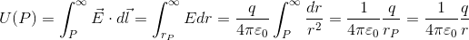
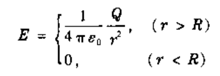
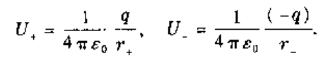
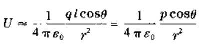
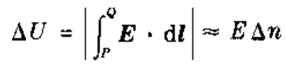

1. 电场力做功与路径无关    
- 对于单个点电荷产生的电场   
因为     
  
即电场力对试探电荷做功仅与移动的距离有关，与路径无关。    
- 对于任意带电体产生的电场   
因为总场强是由点电荷的叠加，因为点电荷产生的电场做功与路径无关，所以任意带电体产生的电场做功与路径无关。    
即**试探电荷在任何静电场中移动时，电场力所做的功只与这试探电荷电量的大小及其起点、终点的位置有关，与路径无关。**   
这个结论等价于   
   
即**静电场中场强然任意闭合环路的线积分，即环量恒等于0。**此称为静电场的环路定理。   
2. 电势与电势差   
定义    
   
上式表明，电场力做功与试探电荷的电量q0成正比，但电场力做功与试探电荷的比值与试探电荷无关，只是电场本身在P、Q两点的性质。因此定义此比值为电场P、Q两点间的电势差，或称电势降落、电压。亦可描述为
从P到Q移动单位正电荷时电场力所做的功，或者说，单位正电荷的电势能差。   
因为这是一个差值，所以要确定空间某一点的电势是多少，则需要选定参考点。令参考点电势为0，则其它各点与此参考点之间的电势差定义为改点的电势值。理论计算中，如果带电体系局限在有限大小的空间里，通常选择无穷远点为电势的参考位置。
这样空间任意点的电势为    
   
因而，也可以推得   
   
即UPQ=U(P)-U(Q)    
2. 单个点电荷q产生的电场中各点的电势   
    
3. 均匀带电球壳产生的电场及电势    
根据高斯定理电场为   
    
根据电势的定义，电势为P点到无穷远的积分，分为球壳内和球壳外两种情况    
    
根据此结论可知，球壳内为等势体；且电势不会发生突变，场强会发生突变。   
4. 因为电场强度满足叠加原理，所以电势也满足叠加原理。    
5. 求带电为±q，距离为l的电偶极子任一点的电势。     
点电荷分别存在时的电势为     
     
则总电势为     
    
设r为电偶极子中心到场点的距离，r+和r-分别为电荷到场点的距离，则当r远远大于l时，近似存在下述关系       
       
代入U的表达式得    
    
即     
     
忽略l的平方项得     
   
写成向量点积的形式为     
   
可见，电偶极子在远处的性质是由电偶极矩表征的。     
6. 等势面   
- 等势面与电场线处处正交   
当点电荷q0沿等势面做任意元位移dl，电场力做功为APQ=q0[U(P)-U(Q)]=q0Edlcosθ=0，q0，Edl均不为0，所以必然cosθ=0，即E与dl垂直。     
- 等势面密集的地方场强大，稀疏的地方场强小   
取一对电势分别为U和U+ΔU的邻近等势面，做一条电场线与两等势面分别交于P，Q，因为两个面十分接近，PQ可看成两等势面间的垂直距离Δn。根据环路定理及积分中值定理，则有    
    
或者写成   
    
取极限，则有
   
上式表明Δn小的地方，等势面密集，场强大，反之，场强小。    
- 关于积分中值定理(证明略)   
   
7. 电势梯度  
电势沿某一方向的方向导数为     
    
电势沿垂直于等势面方向的方向导数为   
   
设Δl和Δn之间的夹角为θ，则Δn=Δlcosθ，则可得   
    
即   
   
可知，U沿垂直于等势面的方向变化速度最快（变化率最大），这个方向的方向导数称为U的梯度，用gradU或▽U来表示。因为    
    
且E总是指向电势减少的方向，即E与ΔU的方向相反，所以E为电势梯度的负值    
   
它在任意方向的投影为    
    
    
