1. 欧几里得空间就是在对现实空间的规则抽象和推广（从n<=3推广到有限n维空间）。欧几里得几何就是中学学的平面几何、立体几何，在欧几里得几何中，平行线任何位置的间距相等。而中学学的几何空间一般是2维，3维（所以，我们讨论余弦值、点间的距离、内积都是在低纬空间总结的），如果将这些低维空间所总结的规律推广到有限的n维空间，那这些符合定义的空间则被统称为欧几里得空间（欧式空间，Euclidean Space）。
欧几里得空间主要是定义了内积、距离、角，其准确地定义为：    
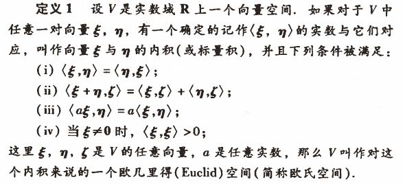   
2. 连通区域：平面上的一个区域G，如果在其中任做一条简单闭曲线，而闭曲线的内部总属于G，就称G为单连通区域。一个区域如果不是单连通区域，就称为多连通区域。   
3. 连续函数：在数学中，连续是函数的一种属性。直观上来说，连续的函数就是当输入值的变化足够小的时候，输出的变化也会随之足够小的函数。如果输入值的某种微小的变化会产生输出值的一个突然的跳跃甚至无法定义，则这个函数被称为是不连续的函数（或者说具有不连续性）。    
- 设f是一个从实数集的子集I包含于R映射到J包含于R的函数：f:I→J。f在I的某个点c处是连续的当且仅当以下两个条件满足：
  - f在c上有定义
  - c是I中的一个聚点，并且无论自变量x在I中以什么方式接近c，f(x)的极限都存在且等于f(c)。
  我们称函数到处连续或处处连续，或者简单的称为连续，如果它在其定义域中的任意一点处都连续。更一般地，当一个函数在定义域中的某个子集的每一点处都连续时，就说这个函数在这个子集上是连续的。     
- 不用极限的概念，也可以用下面所谓的ε − δ方法来定义实值函数的连续性。   
  - 仍然考虑函数f:I→J。假设c是f的定义域中的元素。函数f被称为是在c点连续且当仅当以下条件成立：对于任意的正实数ε>0，存在一个整十数δ>0使得对于任意定义域中的x∈I，只要x满足c-δ<x<c+δ，就有f(c)-ε<f(x)<f(c)+ε成立。   
  - 此定义，首先由柯西给出。更直观地，函数f是连续的当且仅当任意取一个J中的点f(c)的邻域Ω，都可以在其定义域I中选取点x的足够小的邻域，使得x的邻域在函数f上的映射下都会落在f(c)的邻域Ω之内。   
4. 可微    
- 一元函数的可微性   
  - 设函数y=f(x)定义在点x0某邻域U(x0)上，当给x0一个增量Δx，x0+Δx∈U(x0)时，相应的得到函数的增量为Δy=f(x0+Δx)-f(x0)。如果存在常数A，
  使得Δy能表示成Δy=AΔx+o(Δx)，则称函数f在点x0可微，并称AΔx为f在点x0的微分，记做      
  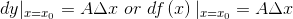        
  定义可见，函数的微分与增量仅相差一个关于Δx的高阶无穷小量，由于dy是Δx的线性函数，所以当A≠0时，也说微分dy是增量Δy的线性主部。    
  即函数f在点x0可导和可微是等价的。      
  - 可微的充要条件：函数f在点x0可微的充要条件是函数f在点x0可导，且A等于f'(x0)。     
- 二元函数可微性   
  - 定义   
  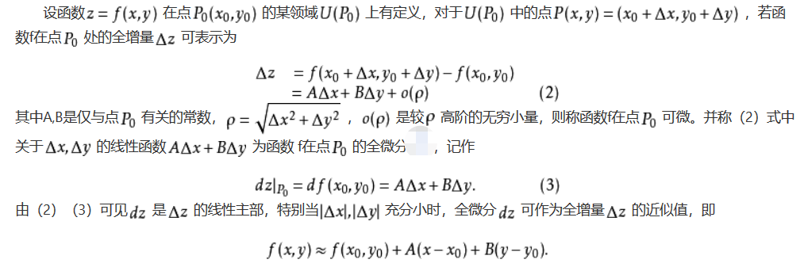       
  总结：可微，有定义，全微分，全增量。   
  - 可微的必要条件   
  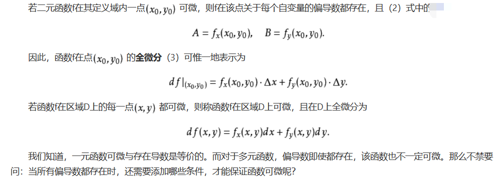   
  - 可微的充分条件    
  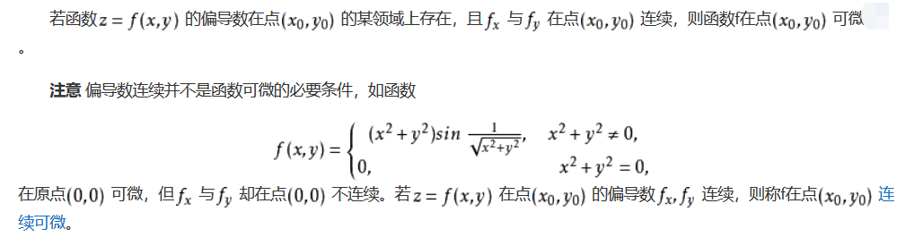    
  - 微分到底是什么？
    - 微分本质是一个微小的线性变化量，是用一个线性函数作为原函数变化的逼近（或者叫近似）。微分的定义是从导数而来的，由导数定义有      
	    
	那么则有     
	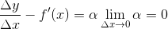          
	则可以得到如下结果：    
	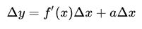       
	当Δx趋近于0，显然有Δy≈f'(x)Δx。     
	现在我们将f'(x)Δx定义为dy。而Δy表示的是函数值的变化，显然dy的真正含义是对这种变化的逼近。也就是说我们定义微分，就是想借助微分这个工具来研究函数的变化趋势。      
	从上面你可以明白两件事，第一微分，即dy不是一个符号哦，是真的有具体值得，它的值为f'(x)Δx，第二观察下f'(x)Δx显然是一个关于Δx的线性函数，因此微分其实在一点处，用一个线性函数的变化来逼近函数的变化。      
5. 多元函数函数求导法则    
- 什么是导数？    
在物理学，导数就是变化率。     
把导数看作是变化率、是切线的斜率，在多元函数中是片面的，甚至是不正确的。    
- 微积分的基本思想    
微积分的基本思想是“以直代曲”：“以直代曲”的意思就是，切线可以在切点附近很好的近似曲线。    
- 导数是用来找到“线性近似”的数学工具    
因为“**以直代曲**”是微积分的基础，所以我们首要任务就是要找到这个“直”，也就是切线，也就是所谓的“线性近似”。导数就是为了完成这个任务需要使用的数学工具。
- 二元函数的“线性近似”    
导数最主要的目的是找到“线性近似”，在一元函数的时候是要找到切线，在二元函数的时候是要找到一个切平面。      
  - 如何理解全微分？    
  微分得是“直”的（这样才能“代曲”），一元是直线，二元只能是平面。    
  微分和切线有关，一元微分就是切线，二元的情况要复杂一些。     
  二元微分就是所有的切线都存在，并且都在一个平面。如果这样一个平面存在的话，它就是二元的微分，我们也叫它为“切平面”。这个微分可以提供对曲面很好的“线性近似”。    
  - 各种导数     
  过点A可以做无数条曲线，所有这些曲线都可以写成参数方程的形式，偏导数、方向导数、全导数由不同的曲线所决定，偏导数（沿坐标轴）、方向导数（沿射线）其实是特殊的全导数（任意形状曲线）。      
  - 复合函数求导    
  若函数及都在t点可导；函数在对应点(u,v)具有连续偏导数，则复合函数在t点可导，且其导数为      
  证明：     
  设t获得增量Δt，这时u=Ψ(t)及v=Φ(t)的对应增量为Δu，Δv，函数z=f[Ψ(t),Φ(t)]的对应增量为Δz。    
  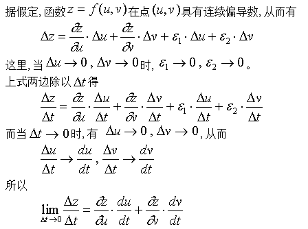      
- 曲线坐标   
在三维欧式空间的一个连通域Ω中给定一个直角坐标系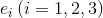。区域Ω中的任一点M在这一坐标系中的分量用大写字母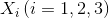表示。设有Xi的三个连续可微的单值函数    
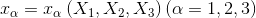      
它的反函数    
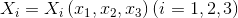    
假定也单值连续可微，则xα(α=1,2,3)可以代替Xi(i=1,2,3)作为Ω中点的坐标，称为曲线坐标。     
  - 球坐标    
  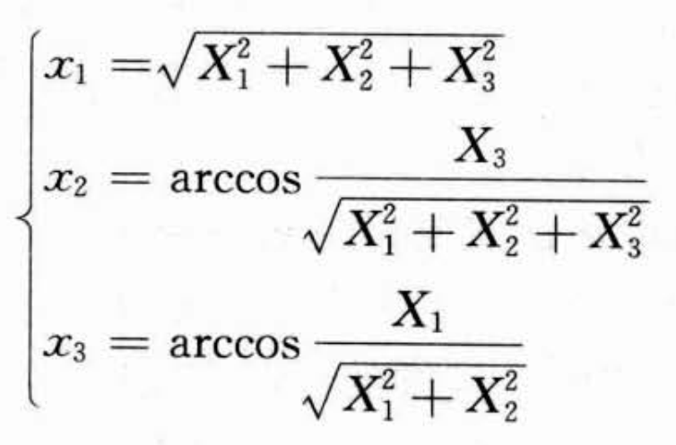     
  式中，0≤x1≤2π，0≤x2≤π。反过来     
  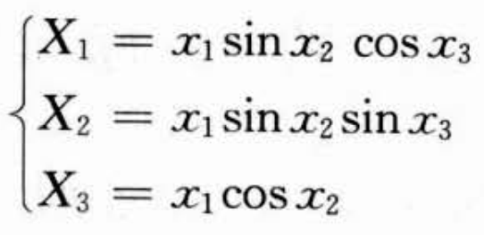    
  0≤x1<∞，0≤x2≤π，0≤x3<2π。    
  则除了x1=0(X1=X2=X3=0)一点外，上面两组式子都是单值连续可微的函数，因而可用(x1，x2，x3)形成的曲线坐标来表示(X1,X2,X3)所形成的坐标。    
  习惯上写     
  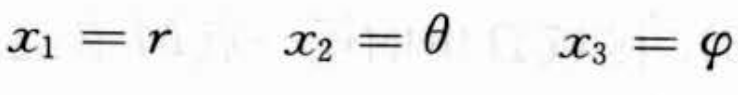     
  - 柱坐标      
  令     
  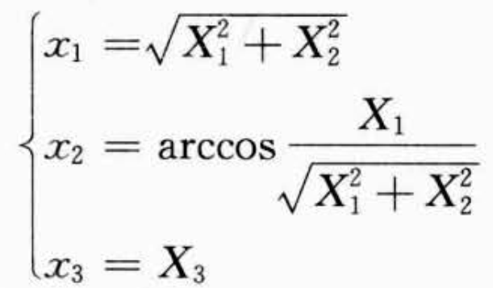    
  式中，0≤x2＜2π，所有根号都取正值。反过来，     
  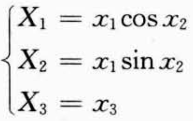     
  其中     
  0≤x1＜∞，0≤x2＜2π，-∞＜x3＜∞     
  则除了x1=0(X1=X2=0)一条直线外，上面两组式子都是单值连续可微的函数。因而（x1,x2,x3）形成曲线坐标。习惯上写    
  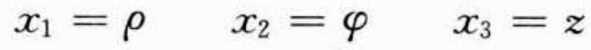    
  称为柱坐标。     
  - 坐标线与坐标面     
  在直角坐标系中，坐标线和坐标面是一些相互垂直的直线和平面。坐标基矢ei(i=1,2,3)既是沿坐标线Xi在Xi增加方向上的单位矢量，又是垂直于“等Xi面"的单位矢量。
  它们是三个大小和方向都不变的常矢量，满足正交单位条件。   
  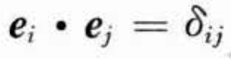    
  曲线的坐标定义式可写为     
  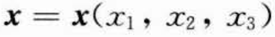    
  式中，x是空间点的矢径。此式中，令某一个xα改变，其余两个xβ(β≠α)保持不变，所得到的点的集合形成一条曲线，称为坐标线xα。另一方面，如果固定xα而让xβ变，
  则得到一个曲面，称为坐标面——等xα。对于曲线坐标，坐标线和坐标面一般来说是曲线和曲面。      
  - 局部标架     
  考虑空间的任意一点M，其矢径为x。在这一点和坐标线xα相切并指向xα增加方向的单位矢量用eα表示。三个eα（α=1,2,3）形成一组坐标基矢，它们在空间不同点有不同的方向，
  因此称由它们组成的坐标系为局部标架。图为球坐标和柱坐标点M处的局部标架。       
  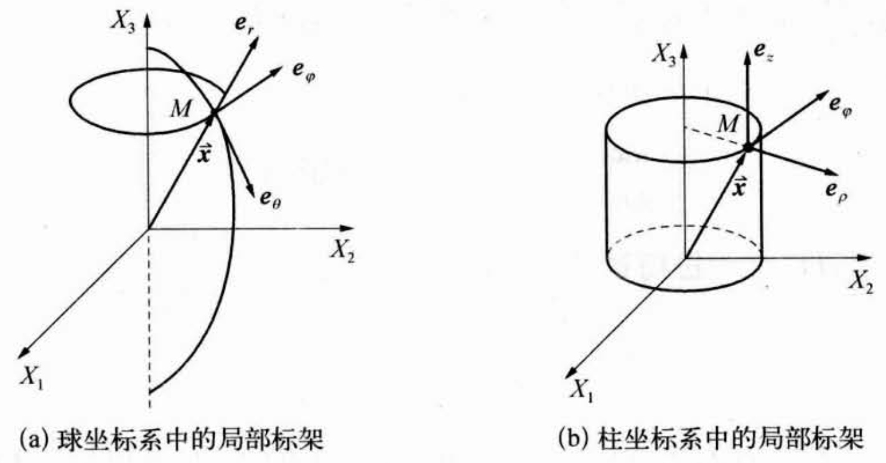     
  如果在空间的每一点M，局部标架的基矢eα(M)都相互正交，即       
  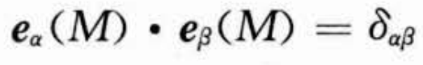     
  则称这一曲线坐标为正交曲线坐标。球坐标和柱坐标都是正交曲线坐标。     
  - 拉梅系数   
  对上面**曲线坐标的定义式**求微分得      
  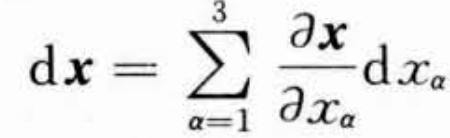        
  如果只有一个xα增加（dxα＞0），而另两个保持不变（dxβ=0，当β≠α），则矢量dx沿坐标线xα的切线，指向xα增加的方向。此时，上式右边的和式只剩下含
  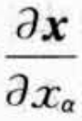的一项。由此可见，是沿坐标线xα的切线指向xα增加方向的一个矢量。但是这一方向上的单位矢量是eα，因而有     
  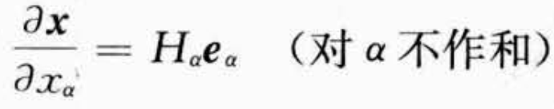     
  式中，Hα称为拉梅系数，它等于上式左边矢量的模，即     
  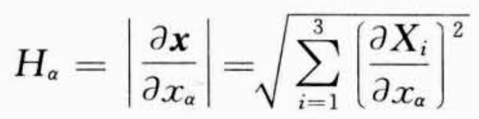   
  - 球坐标的拉梅系数     
  球坐标表示为         
  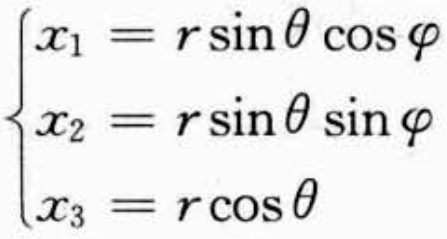       
  根据拉梅系数的计算公式，得     
  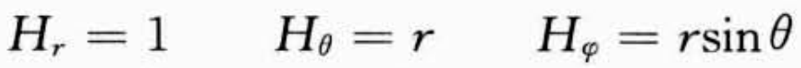     
  - 曲线坐标中的体积元    
  将矢径的微分dx按曲线坐标中的局部标架eα展开，得   
  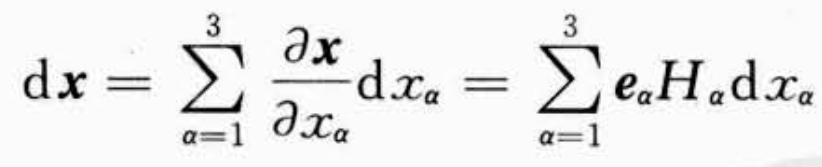    
  **dx在局部标架eα的分量**是       
  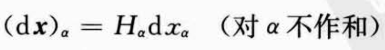    
  如在球坐标中dx各分量为     
  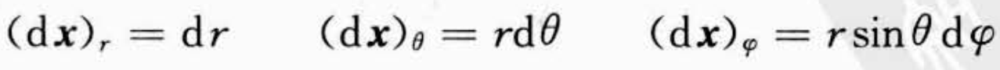      
  在正交曲线坐标中，三个eα相互垂直，因而(dx)α构成的体积元的体积为     
  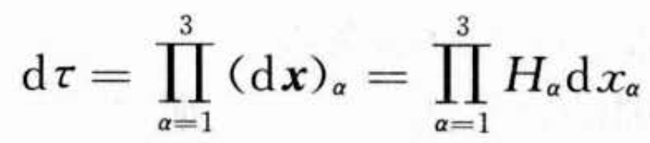     
  如球坐标中的体积元为      
  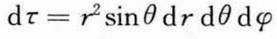       
  - 曲线坐标中的弧长     
  即为局部标架中三个分量的平方的和再开方，即     
  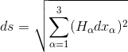         
  对于球坐标为     
  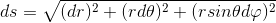    
  - 曲线坐标系中的梯度     
  因为Xi是xα的函数，xα又是Xj的函数。根据复合函数求导法则，可以求Xi对Xj的导数      
  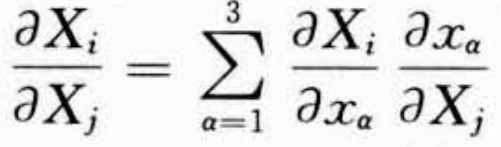     
  但是，上式在i=j时等于1，i≠j时等于0，因而        
  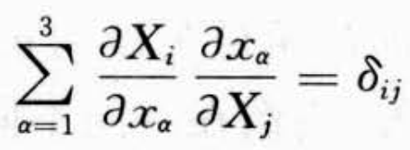     
  同理，也可得xα对xβ的导数     
  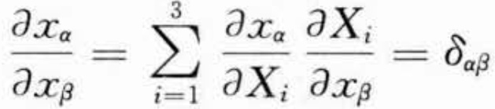       
  同时，又知，xα是**x**的函数，所以xα可看做一个标量场（数值场），它的梯度指向正“等xα面”正法线方向的矢量。对于正交曲线坐标，“等xα面”的法线方向就是坐标线
  xα的切线方向（平行于xα方向）。因此        
  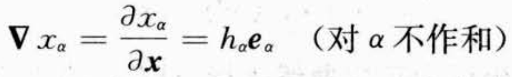     
  同时有下式的成立     
  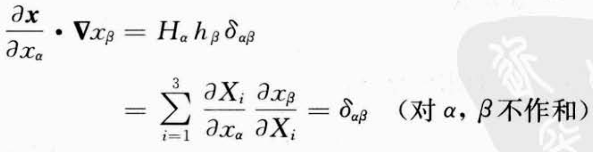     
  所以有下式的成立      
  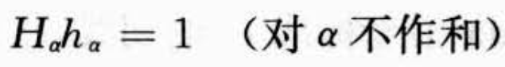    
  又因为dx在局部标架的分量是     
       
  所以标量场的梯度为     
  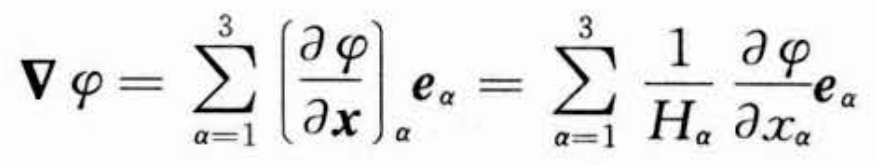      
  可见，梯度指向等xα面的方向，可分解为3个分量，分别指向3个坐标线的方向。梯度的分量构成的矢量其实就是曲面上某点的法向分量。      
  为什么所有的切线都在一个平面上呢？     
  因为所有的切线都过同一点且垂直于法向量。并且取切平面上任一点，根据点法式可以求得切平面方程。      
  - 再谈微分与积分中相关概念     
    - 函数的连续性
	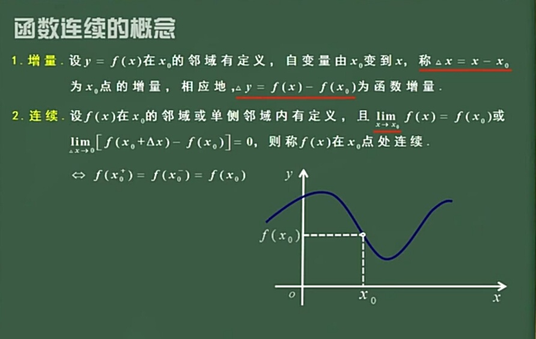     
	- 可微    
	可微指增量可以表示为全微分+高阶无穷小的形式。     
	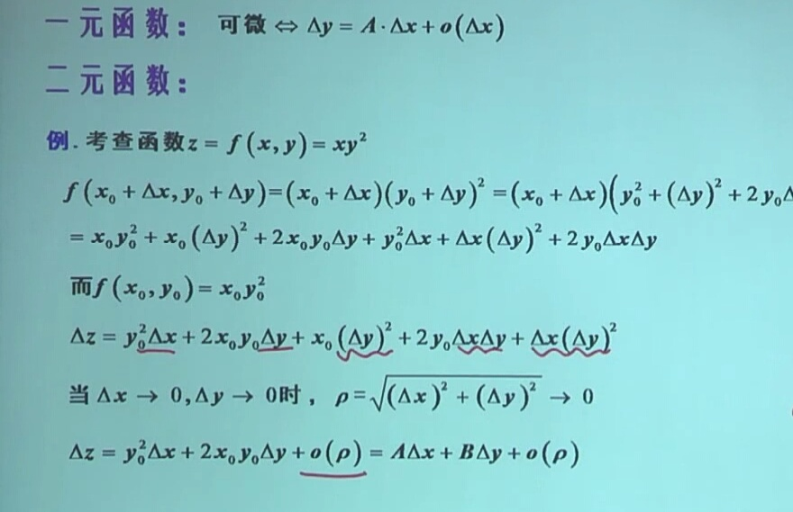       
    可微可以推出函数连续         
    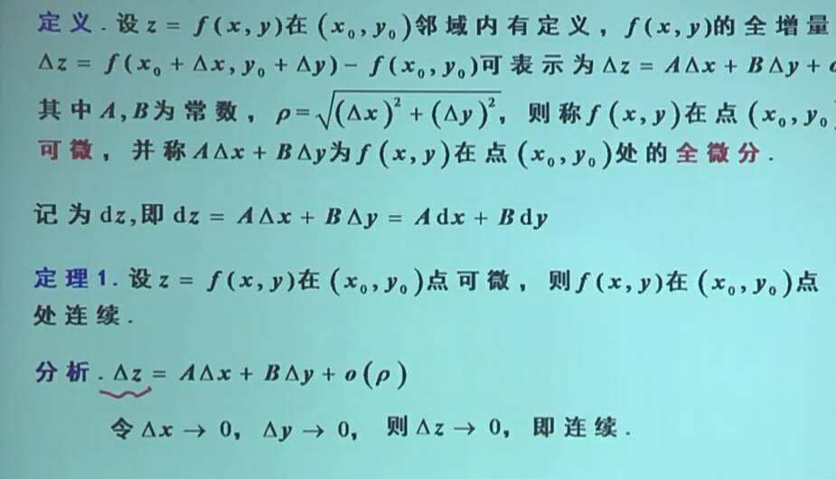      
    可微可以推出偏导数存在      
    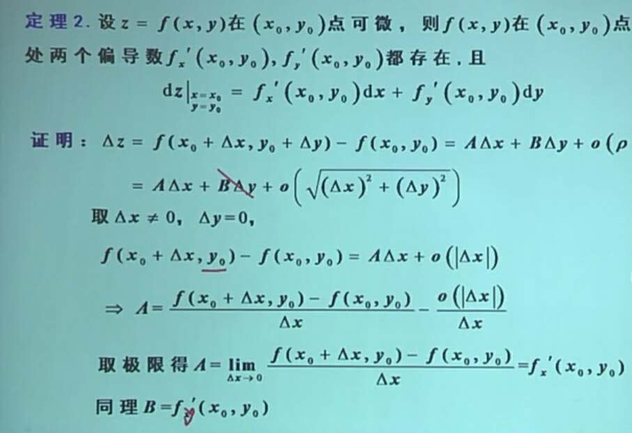    
    偏导存在不一定可微      
    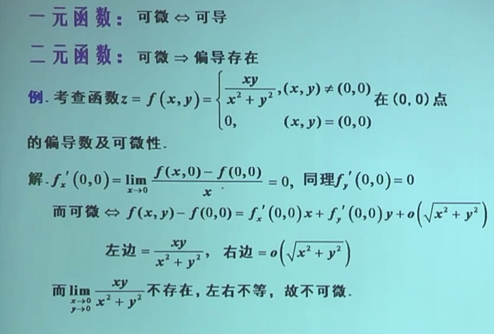     
    偏导存在并连续可以推出可微     
    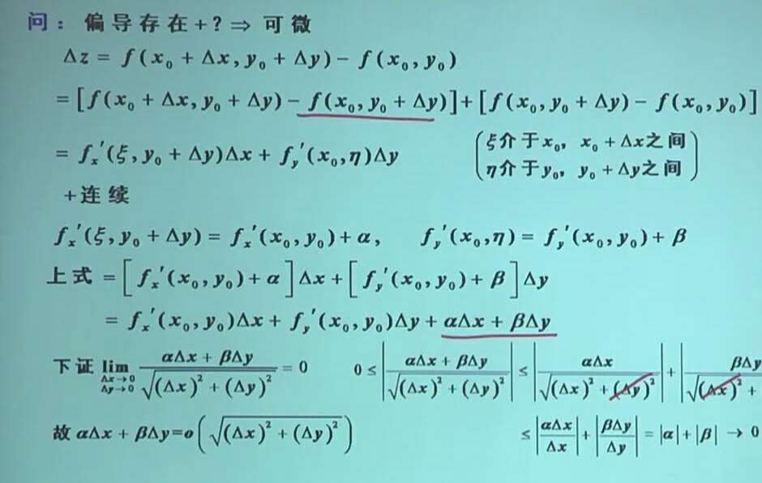      
    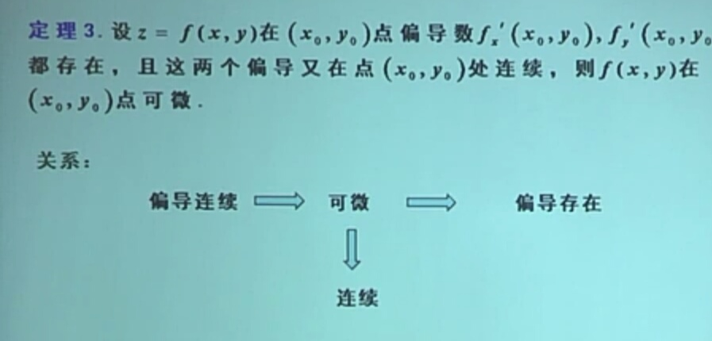      
    微分的几何意义     
    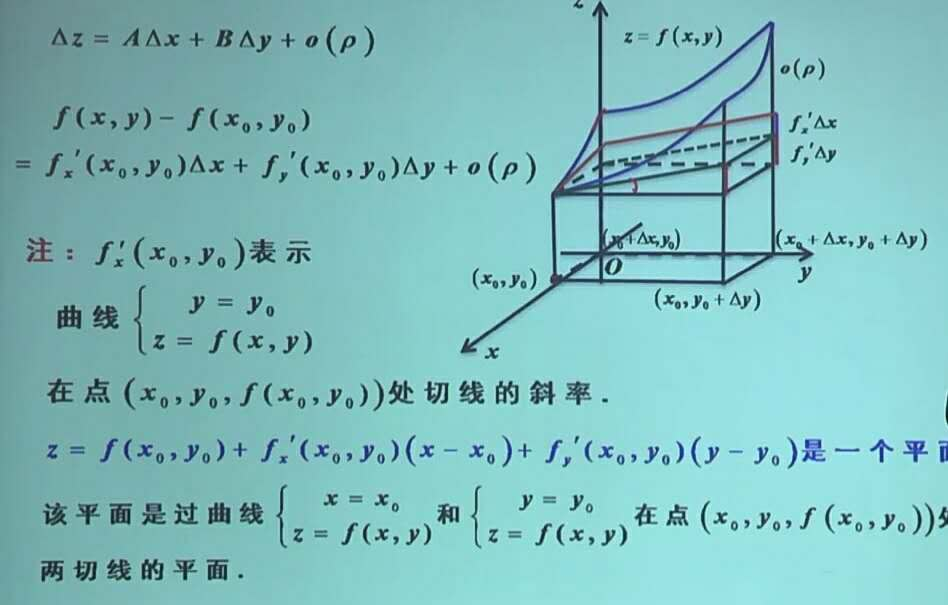      
    - 空间的线与面   
           
          
        
    切平面与法向量     	
        	
	      
	全微分是个切平面     
	    
	
  
     
    
    
    	
  