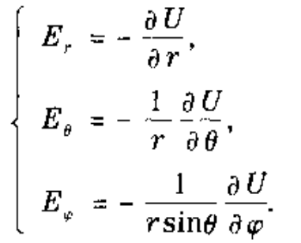
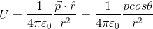
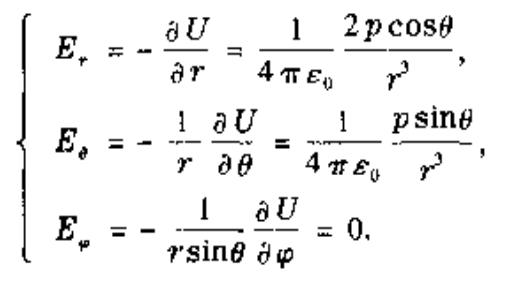

1. 根据电偶极子的电势求电场      
在具体问题中，要根据对称性选取适当的坐标系来求出矢量的各个分量。对于电偶极子，因它具有轴对称性，最方便的方法是以它自身的轴（从负电荷到正电荷的方向，即电偶极矩**p**的方向）为轴取球坐标(r,θ,φ)。
在球坐标系中，场强的各个分量为            
      
因为电偶极子的电势在远处为         
      
由于周队成型，电势与方位角φ无关。**为什么与方位角φ无关？**因为是轴对称，所以在以以轴为圆心的圆弧上各点上电势处处相等，与旋转过多少角度无关，即电势与方位角φ无关。     
因为电势与φ无关，所以其对φ的偏导为0。所以电场的φ分量为0。 即     
      
可以看到，由于电势是标量，用叠加原理比计算场强方便得多。所以可以先求电势，然后利用微商或梯度的方法求场强。从这一方面体现了引进电势这个标量的优越性。      
